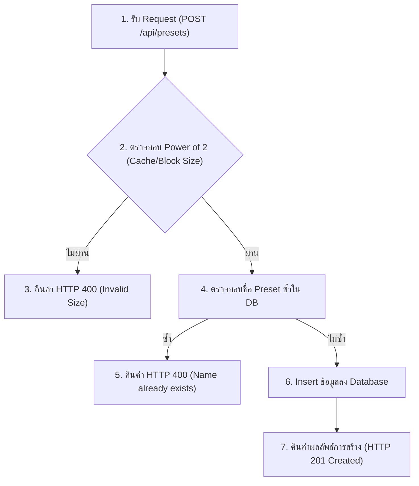

# แผนการพัฒนา: STORY-11 - API สำหรับการจัดการ Preset (Preset Management API)

## สรุป (Summary)
แผนการพัฒนานี้มีรายละเอียดเกี่ยวกับการสร้าง API สำหรับจัดการ Preset หรือ "การตั้งค่าล่วงหน้า" ของระบบจำลอง Cache เพื่อให้อาจารย์ผู้สอนสามารถบันทึกค่าและดึงกลับมาใช้ใหม่ได้อย่างรวดเร็ว โดยจะประกอบไปด้วย Endpoint `GET /api/presets` สำหรับดึงรายการ และ `POST /api/presets` สำหรับการบันทึกเพิ่มเข้าฐานข้อมูล นอกจากนี้ต้องมีการตรวจสอบ (Validation) ว่า Cache Size และ Block Size เป็นตัวเลขฐาน Power of 2 (เช่น 2, 4, 8, 16) รวมไปถึงจัดการชื่อที่ซ้ำกันให้แสดงผลข้อผิดพลาดให้ถูกต้อง

## เรื่องราวของผู้ใช้งาน (User Story)
ในฐานะอาจารย์ผู้สอน
ฉันต้องการ API เพื่อจัดเก็บและดึงข้อมูลการตั้งค่า Cache 
เพื่อให้ระบบหน้าบ้านนำไปสร้างระบบ Preset ดึงค่ากลับมาใช้ได้อย่างรวดเร็ว

## ข้อมูลเบื้องต้น (Metadata)
| Field | Value |
|-------|-------|
| ประเภท (Type) | NEW_CAPABILITY |
| ความซับซ้อน (Complexity) | SMALL |
| ระบบที่เกี่ยวข้อง (Systems Affected) | backend (API, DB) |
| Jira Issue | STORY-11 |
| Source Control | พัฒนาบน `main` branch ได้เลย ไม่ต้องสร้าง branch ใหม่ |

---

## คุณสมบัติและรูปแบบการทำงาน (Features & I/O)

### ฟีเจอร์ที่รองรับ (Features)
1. **Get All Presets**: ดึงรายการ Preset ทั้งหมดในฐานข้อมูลเรียงตามเวลาที่สร้างล่าสุด
2. **Create New Preset**: สร้างการตั้งค่าใหม่โดยใช้ Pydantic Model ในการทำ Validation 
3. **Power of 2 Validation**: ตรวจสอบ `cache_size` และ `block_size` ให้อยู่ในกฎ Power of 2 (2^N) 
4. **Duplicate Name Prevention**: จัดการ Unique Constraint กรณีผู้ใช้บันทึกชื่อ Preset ซ้ำกัน

### รูปแบบข้อมูล (Input / Process / Output)
- **Input (POST Request - JSON Body)**:
  ```json
  {
    "name": "L1 Cache Test",
    "cache_size": 32,
    "block_size": 64,
    "mapping_type": "Set-Associative",
    "n_way": 4,
    "replacement_policy": "LRU"
  }
  ```
- **Process (POST)**:
  1. ตรวจสอบว่า `cache_size` และ `block_size` เป็น Power of 2 หรือไม่ (ถ้าไม่ใช่ ส่ง 400 Bad Request)
  2. Query ฐานข้อมูลหา `name` ที่ตรงกัน (ถ้ามีแล้ว ส่ง 400 Bad Request: Name already exists)
  3. บันทึกข้อมูลลงตาราง `presets`
- **Output (GET / POST Response)**:
  - กรณี GET คืนค่าเป็น Array ของ Preset Objects
  - กรณี POST คืนค่า Preset Object ที่สร้างเสร็จพร้อมกับ `id`

---

## Workflow (แผนผังการทำงาน)



---

## ไฟล์ที่ต้องเปลี่ยนแปลง (Files to Change)

| ไฟล์ (File) | การกระทำ (Action) | วัตถุประสงค์ (Purpose) |
|------|--------|---------|
| `backend/app/schemas.py` | UPDATE | สร้าง Pydantic Model (`PresetCreate`, `PresetResponse`) สำหรับตรวจสอบ Input/Output |
| `backend/main.py` | UPDATE | เพิ่ม Endpoint `GET /api/presets` และ `POST /api/presets` |
| `backend/tests/test_api.py` | UPDATE | เพิ่ม Unit Test กรณีสร้าง Preset ได้สำเร็จ, กรณีกำหนด Size ผิด และกรณีชื่อซ้ำ |

---

## งานที่ต้องทำ (Tasks)

### Task 1: สร้าง Pydantic Models และ Validation
- **ไฟล์ (File)**: `backend/app/schemas.py` (หรือเขียนลง `main.py` ก่อนหากไฟล์ยังไม่มี)
- **การทำงาน (Implement)**:
  - สร้างคลาส `PresetCreate(BaseModel)` พร้อมประกาศฟิลด์ข้อมูล
  - ใช้งาน `@field_validator` หรือ `@validator` ตรวจสอบ `cache_size` และ `block_size` ให้ตรงเงื่อนไข Power of 2 `(n > 0 and (n & (n - 1)) == 0)` หากไม่ใช่ให้ `raise ValueError`
  - สร้างคลาส `PresetResponse` ให้มี `id` และ `created_at` เพิ่มเข้ามาพร้อมกำหนด `from_attributes = True`

### Task 2: สร้าง API Endpoints (GET & POST)
- **ไฟล์ (File)**: `backend/main.py`
- **การทำงาน (Implement)**:
  - **GET /api/presets**: Query ข้อมูล `Preset` ทั้งหมด ดึงผ่าน `.all()`
  - **POST /api/presets**: 
    - รับ `preset: PresetCreate`
    - ตรวจสอบชื่อในฐานข้อมูล `db.query(Preset).filter(Preset.name == preset.name).first()` หากพบให้ `raise HTTPException(400, "Preset name already exists")`
    - แปลงข้อมูลแล้วทำการเพิ่ม (`db.add`) ตามด้วย `db.commit()` และ `db.refresh()`

### Task 3: ทดสอบการทำงาน (Validation)
- **ไฟล์ (File)**: `backend/tests/test_api.py`
- **การทำงาน (Implement)**:
  - ทดสอบ `POST /api/presets` ด้วยข้อมูลที่ถูกต้อง คาดหวัง Code 201 หรือ 200
  - ทดสอบ `POST /api/presets` ด้วยชื่อที่ซ้ำเดิมซ้ำอีกรอบ คาดหวัง Code 400
  - ทดสอบ `POST /api/presets` โดยส่ง `cache_size = 30` (ไม่ใช่ Power of 2) คาดหวัง Code 400 
  - ทดสอบ `GET /api/presets` คาดหวังว่าจะต้องเห็น Preset ที่เพิ่งสร้างไปปรากฏอยู่ในลิสต์

---

## เกณฑ์การยอมรับ (Acceptance Criteria)
- [ ] Endpoint `POST /api/presets` บันทึกค่าล่วงหน้าลงฐานข้อมูลสำเร็จ
- [ ] Endpoint `GET /api/presets` ดึงรายการ Preset ทั้งหมดออกมาได้สำเร็จ
- [ ] การป้องกันและรับมือข้อผิดพลาด (Constraints) ของฐานข้อมูลเช่น ชื่อห้ามซ้ำ จัดการได้ดีและคืนค่า Error 400
- [ ] ตรวจสอบเงื่อนไข Power of 2 ได้อย่างสมบูรณ์แบบก่อนให้ระบบบันทึกค่า
