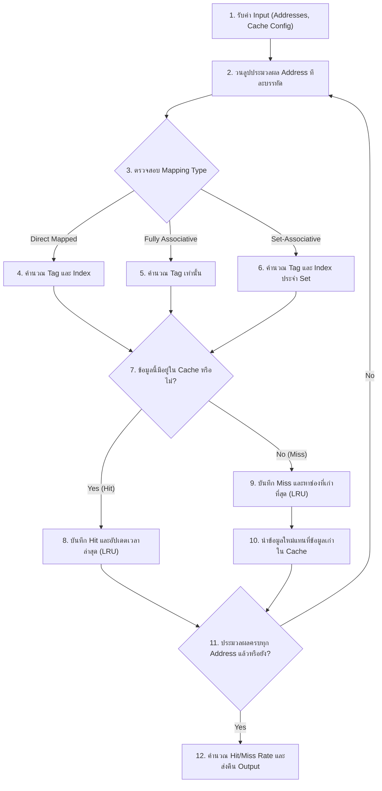

# แผนการพัฒนา: STORY-3 - พอร์ตตรรกะจำลองการทำงานของ Cache เป็น Python

## สรุป (Summary)

แผนการพัฒนานี้มีรายละเอียดเกี่ยวกับขั้นตอนการพอร์ต (Port) ตรรกะหลักในการจำลอง Cache จากไฟล์ต้นฉบับภาษา C++ (`cachesim.cpp`) มาเป็นภาษา Python โดยตรรกะนี้จะเป็นหัวใจสำคัญของ Backend Simulation Engine ในการคำนวณ Hit และ Miss ให้ตรงกับเวอร์ชัน C++ อย่างแม่นยำที่สุด เราจะสร้างโมดูล `simulator.py` ซึ่งจะเก็บฟังก์ชันการจำลองไว้ และสร้างไฟล์ `test_simulator.py` สำหรับรัน Unit Tests เพื่อรับประกันความถูกต้องแม่นยำ 100% เมื่อเทียบกับผลลัพธ์ที่คาดหวัง

## เรื่องราวของผู้ใช้งาน (User Story)

ในฐานะนักศึกษา
ฉันต้องการให้ระบบจำลองบน Python สามารถคำนวณอัตรา Hit และ Miss ได้ตรงกับโค้ด C++ ต้นฉบับทุกประการ
เพื่อให้ผลลัพธ์เพื่อการศึกษาและตัวชี้วัดมีความแม่นยำสูงสุด

## ข้อมูลเบื้องต้น (Metadata)

| Field | Value |
|-------|-------|
| ประเภท (Type) | NEW_CAPABILITY |
| ความซับซ้อน (Complexity) | HIGH |
| ระบบที่เกี่ยวข้อง (Systems Affected) | backend (algorithm) |
| Jira Issue | STORY-3 |

---

## คุณสมบัติและรูปแบบการทำงาน (Features & I/O)

### ฟีเจอร์ที่รองรับ (Features)
1. **Direct Mapped Simulation**: การจำลองการเก็บข้อมูลแบบมีตำแหน่งตายตัว
2. **Fully Associative Simulation**: การจำลองการเก็บข้อมูลแบบยืดหยุ่นเต็มรูปแบบ รองรับนโยบายการจัดเก็บ/ลบทิ้งแบบ LRU (Least Recently Used)
3. **Set-Associative Simulation**: การจำลองแบบผสม รองรับนโยบาย LRU ในแต่ละ Set ย่อย

### รูปแบบข้อมูล (Input / Process / Output)
- **Input**:
  - `cache_size_kb` (int): ขนาดของ Cache ในหน่วย KB
  - `block_size` (int): ขนาดของ Block ในหน่วย Bytes
  - `sets` (int): จำนวน Set (ใช้เฉพาะใน Set-Associative)
  - `addresses` (List[str]): รายการของที่อยู่หน่วยความจำรูปแบบเลขฐาน 16 (Hexadecimal string)
- **Process**:
  - แปลงเลขฐาน 16 เป็นตัวเลขฐาน 10 (Decimal)
  - คำนวณจำนวน Bits ของ Tag, Index, และ Offset ผ่านสมการ Log2
  - จำลองการเข้าถึง Cache ทีละ Address
  - ประเมินสถานะ Hit/Miss และจัดเก็บตัวนับเวลา (Global Time) สำหรับระบบ LRU
- **Output**:
  - `hits` (int): จำนวนครั้งที่พบข้อมูลใน Cache (Cache Hit)
  - `misses` (int): จำนวนครั้งที่ไม่พบข้อมูลใน Cache (Cache Miss)
  - `hit_rate` (float): เปอร์เซ็นต์การเกิด Hit
  - `miss_rate` (float): เปอร์เซ็นต์การเกิด Miss

---

## Workflow (แผนผังการทำงาน)



---

## รูปแบบที่ควรปฏิบัติตาม (Patterns to Follow)

### Bitwise and Log2 Operations
```python
# backend/app/simulator/utils.py
import math

def log2_int(n: int) -> int:
    if n <= 0 or (n & (n - 1)) != 0:
        raise ValueError("Value must be a power of 2!")
    return int(math.log2(n))

def hex_to_dec(hex_str: str) -> int:
    return int(hex_str.strip(), 16)
```

### การจัดการสถานะ (Simulation State Management)
```python
# backend/app/simulator/core.py
from dataclasses import dataclass

@dataclass
class CacheBlock:
    tag: int = 0
    valid: bool = False
    last_used: int = 0
```

---

## ไฟล์ที่ต้องเปลี่ยนแปลง (Files to Change)

| ไฟล์ (File) | การกระทำ (Action) | วัตถุประสงค์ (Purpose) |
|------|--------|---------|
| `backend/app/simulator/utils.py` | CREATE | ฟังก์ชันช่วยเหลือ (`log2_int`, `hex_to_dec`) ให้ตรงกับ C++ |
| `backend/app/simulator/core.py` | CREATE | ฟังก์ชันหลัก (`direct_map`, `fully_associative`, `set_associative`) และคลาส `CacheBlock` |
| `backend/tests/test_simulator.py` | CREATE | Unit tests เพื่อตรวจสอบผลลัพธ์ Python เทียบกับต้นฉบับ C++ |

---

## งานที่ต้องทำ (Tasks)

ให้ดำเนินการตามลำดับ แต่ละงานเป็นอิสระต่อกันและสามารถตรวจสอบผลลัพธ์ได้

### Task 1: สร้าง Utilities สำหรับ Simulator และโครงสร้างหลัก
- **ไฟล์ (File)**: `backend/app/simulator/utils.py`, `backend/app/simulator/core.py`
- **การกระทำ (Action)**: CREATE
- **การทำงาน (Implement)**: 
  - สร้าง dataclass `CacheBlock` ซึ่งประกอบด้วย `tag`, `valid`, และ `last_used` (สำหรับติดตามคิว LRU)
  - พอร์ตลอจิก `log2_int` โดยต้องมีการ `raise ValueError` ถ้าค่าที่รับมาไม่ใช่ Power of 2 (เหมือนกับ `exit(1)` ของ C++)
  - พอร์ตลอจิก `hex_to_dec` เพื่อแปลงสตริงเลขฐานสิบหกให้ถูกต้อง
- **การตรวจสอบ (Validate)**: ตรวจสอบ Syntax ของ Python และลองตรวจดูด้วยสายตาว่าคำนวณ Bitwise ตรงกับต้นฉบับ

### Task 2: พอร์ตอัลกอริทึมจำลองรูปแบบการจัดเก็บ (Cache Mapping Algorithms)
- **ไฟล์ (File)**: `backend/app/simulator/core.py`
- **การกระทำ (Action)**: UPDATE
- **การทำงาน (Implement)**: 
  - พอร์ตลอจิก `Direct_map`: ใช้คำสั่ง `(address >> offset_bits) & (num_blocks - 1)` สำหรับการหา Index
  - พอร์ตลอจิก `Fully_associative`: จำลองตัวแปรเวลากลาง `global_time` เพื่อใช้เตะข้อมูลออก (LRU) โดยต้องค้นหา Tag ที่ตรงกัน หรือช่องที่ค่า `last_used` เก่าที่สุดจากทั้ง Cache
  - พอร์ตลอจิก `Set_associative`: แปลงลอจิกหา index `(address >> offset_bits) & (sets - 1)` และตามด้วยการเตะข้อมูลแบบ LRU เฉพาะเจาะจงในแต่ละ Set
  - ทุกฟังก์ชันจะต้องคืนค่ากลับเป็น Dictionary ที่ประกอบด้วย `hits`, `misses`, `hit_rate`, และ `miss_rate`
- **อ้างอิงจาก (Mirror)**: คำสั่ง Shift bits และจำนวน Loop ต้องเหมือนกับโค้ดต้นฉบับเป๊ะในไฟล์ `CacheInsight/csv_test/cachesim.cpp` บรรทัด 85-253

### Task 3: สร้างระบบ Unit Tests เพื่อเทียบกับผลลัพธ์ C++
- **ไฟล์ (File)**: `backend/tests/test_simulator.py`
- **การกระทำ (Action)**: CREATE
- **การทำงาน (Implement)**: 
  - เขียน `pytest` cases เพื่อรับชุดข้อมูลที่เตรียมไว้ (Addresses list)
  - กำหนดผลลัพธ์ `hits` และ `misses` ให้ตรงตามที่เคยรันด้วยไฟล์โปรแกรม C++ จริง (เช่น ค่าที่ได้จาก `sample3.csv`)
  - สร้างข้อทดสอบครอบคลุมทั้งแบบ Direct Mapped (เช่น 32KB, 64B block), Fully Associative, และ Set-Associative (เช่น 4-way)
- **การตรวจสอบ (Validate)**: รันคำสั่ง `pytest backend/tests/test_simulator.py` และต้องได้ผลลัพธ์ Pass 100%

---

## การตรวจสอบทั้งหมด (Validation)

```bash
cd backend
python -m pytest tests/test_simulator.py -v
```

---

## เกณฑ์การยอมรับ (Acceptance Criteria)

- [ ] ฟังก์ชัน `direct_map`, `fully_associative`, และ `set_associative` ถูกพอร์ตเป็น Python ครบถ้วน
- [ ] ระบบ LRU ที่ใช้ตัวแปร `global_time` สามารถทำงานและจำลองได้แม่นยำเทียบเท่าตัวแปร `last_used` ในภาษา C++
- [ ] มี Unit Tests ที่ตรวจสอบผ่าน 100% ยืนยันความแม่นยำ 1:1 เทียบกับ `cachesim.cpp`
