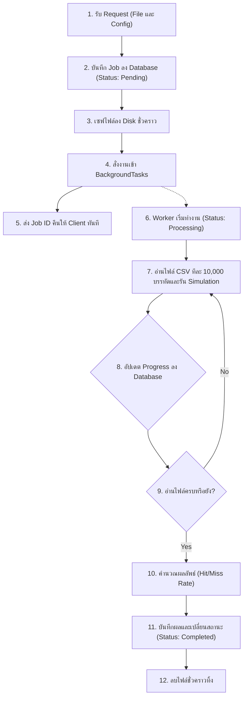

# แผนการพัฒนา: STORY-4 - สร้าง Background Worker และ API สำหรับอัปโหลดไฟล์

## สรุป (Summary)
แผนการพัฒนานี้มีรายละเอียดเกี่ยวกับการสร้าง API สำหรับรับไฟล์เพื่อจำลองการทำงานของ Cache (Simulation) แบบ Asynchronous โดยผู้ใช้สามารถอัปโหลดไฟล์ `.csv` ที่มีข้อมูล Address ขนาดใหญ่ พร้อมตั้งค่า Config ต่างๆ ผ่าน API `POST /api/simulate` จากนั้นระบบจะสร้าง Job ID แล้วนำงานไปรันใน Background (เพื่อไม่ให้บราว์เซอร์ค้าง) และคอยอัปเดตความคืบหน้า (Progress) ลงฐานข้อมูลทุกๆ 10,000 บรรทัด หรือจนกว่างานจะสำเร็จ/ล้มเหลว หลังจากเสร็จสิ้นไฟล์จะถูกลบทิ้งเพื่อประหยัดพื้นที่

## เรื่องราวของผู้ใช้งาน (User Story)
ในฐานะนักศึกษา
ฉันต้องการอัปโหลดไฟล์จำลองข้อมูลขนาดใหญ่ที่จะถูกนำไปประมวลผลอยู่เบื้องหลัง (Background)
เพื่อที่เบราว์เซอร์ของฉันจะได้ไม่ค้างระหว่างที่กำลังรอผลลัพธ์

## ข้อมูลเบื้องต้น (Metadata)
| Field | Value |
|-------|-------|
| ประเภท (Type) | NEW_CAPABILITY |
| ความซับซ้อน (Complexity) | LARGE |
| ระบบที่เกี่ยวข้อง (Systems Affected) | backend (API, Background Tasks, DB) |
| Jira Issue | STORY-4 |

---

## คุณสมบัติและรูปแบบการทำงาน (Features & I/O)

### ฟีเจอร์ที่รองรับ (Features)
1. **File Upload API**: รองรับการอัปโหลดไฟล์ `.csv` พร้อมด้วย JSON configuration 
2. **Background Processing**: ใช้ `BackgroundTasks` ใน FastAPI ทำงานคู่กับ `ProcessPoolExecutor` เพื่อไม่ให้บล็อก Event Loop ของ API
3. **Database Progress Updates**: อัปเดตสถานะ (Pending, Processing, Completed, Failed) และ Progress (%) ลงตาราง `simulation_jobs` อย่างสม่ำเสมอ
4. **Auto Cleanup**: ลบไฟล์ `.csv` ที่บันทึกไว้ชั่วคราวทิ้งอัตโนมัติเมื่อสิ้นสุดกระบวนการ

### รูปแบบข้อมูล (Input / Process / Output)
- **Input (API Request)**:
  - `file` (UploadFile): ไฟล์ `.csv` ที่มีรูปแบบข้อมูลแบบ 1 คอลัมน์ (Single Column) ดังนี้:
    - **บรรทัดที่ 1**: เป็น Header เสมอ (เช่น `Address`) ซึ่งระบบจะข้ามบรรทัดนี้ไป
    - **บรรทัดที่ 2 เป็นต้นไป**: ข้อมูล Memory Address บรรทัดละ 1 ค่า ในรูปแบบเลขฐาน 16 (Hexadecimal) เช่น `00000abc`, `1f2a3b4c`, `0x4f3a` (รองรับทั้งแบบมีและไม่มี `0x`)
  - `config` (Form Data / JSON String): ประกอบด้วย `cache_size_kb`, `block_size`, `mapping_type`, และ `sets` (ถ้ามี)
- **Process**:
  1. API สร้าง `job_id` (UUID) บันทึกลงตาราง `simulation_jobs` ด้วยสถานะ "Pending"
  2. เซฟไฟล์ลงโฟลเดอร์ชั่วคราว (เช่น `backend/uploads/`)
  3. โยนงานเข้า `BackgroundTasks` และ API คืนค่า `job_id` กลับให้ผู้ใช้ทันที
  4. Worker เริ่มอ่านไฟล์ CSV จำลองข้อมูลผ่านฟังก์ชันจาก `simulator.py` (STORY-3) 
  5. บันทึก Progress ลง Database ทุกๆ 10,000 บรรทัด
- **Output (API Response)**:
  - `{"job_id": "uuid-string", "status": "Pending", "message": "Simulation started in background"}`

---

## Workflow (แผนผังการทำงาน)



---

## รูปแบบที่ควรปฏิบัติตาม (Patterns to Follow)

### ProcessPoolExecutor Constraint
```python
import concurrent.futures

# ป้องกันไม่ให้ CPU/RAM หมด เครื่องไม่ค้าง
executor = concurrent.futures.ProcessPoolExecutor(max_workers=2)
```

### Background Task Structure
```python
from fastapi import BackgroundTasks

def process_simulation(job_id: str, file_path: str, config: dict, db_session):
    try:
        # อัปเดตเป็น Processing
        # เปิดไฟล์ -> รัน simulator -> อัปเดต Progress ทุก 10k บรรทัด
        # เซฟ Result เป็น JSON -> เปลี่ยนเป็น Completed
        pass
    except Exception as e:
        # อัปเดตเป็น Failed พร้อม Error Message
        pass
    finally:
        # os.remove(file_path) # ลบไฟล์ทิ้งเสมอ
        pass
```

---

## ไฟล์ที่ต้องเปลี่ยนแปลง (Files to Change)

| ไฟล์ (File) | การกระทำ (Action) | วัตถุประสงค์ (Purpose) |
|------|--------|---------|
| `backend/main.py` | UPDATE | เพิ่ม Endpoint `POST /api/simulate` และ `BackgroundTasks` |
| `backend/app/worker.py` | CREATE | ไฟล์สำหรับเขียนฟังก์ชัน Background Process เพื่อแยกส่วนประกอบชัดเจน |
| `backend/uploads/` | CREATE (DIR) | สร้างโฟลเดอร์สำหรับรับไฟล์ชั่วคราว (พร้อม .gitignore) |

---

## งานที่ต้องทำ (Tasks)

### Task 1: เตรียมโครงสร้าง Worker และ Folder
- **การทำงาน (Implement)**: สร้างโฟลเดอร์ `backend/uploads` (ใส่ไฟล์ `.gitkeep` และ `.gitignore` ให้ ignore `.csv`) สร้างไฟล์ `backend/app/worker.py` สำหรับฟังก์ชัน `run_simulation_job`

### Task 2: เขียนฟังก์ชัน Background Worker
- **การทำงาน (Implement)**: ใน `backend/app/worker.py` สร้างฟังก์ชันที่รับ `job_id`, พารามิเตอร์ Config และพาธไฟล์ 
  - ดึงจำนวนบรรทัดทั้งหมดของไฟล์เพื่อนำมาคำนวณ Progress (100%)
  - ใช้ `simulator.py` ในการประมวลผล
  - ทำ Batching: อัปเดต `% progress` ลง Database `simulation_jobs` ทุกๆ 10,000 บรรทัด 
  - จัดการ `Exception` ถ้าระบบพังให้จับ Error และอัปเดตสถานะเป็น "Failed"
  - ทำความสะอาด: ใช้ `os.remove` เพื่อลบไฟล์ทิ้งในบล็อก `finally` เสมอ

### Task 3: สร้าง API Endpoint 
- **การทำงาน (Implement)**: ใน `backend/main.py`
  - สร้าง Endpoint `POST /api/simulate`
  - รับ `file: UploadFile` และข้อมูล Configuration (`Form`)
  - แทรกแถวลงฐานข้อมูล `simulation_jobs` ทันทีและสร้าง UUID
  - เซฟไฟล์ลงใน `uploads/{job_id}.csv`
  - เรียกใช้ `background_tasks.add_task(...)` เพื่อทำงาน `run_simulation_job` เป็นแบบ Non-blocking
  - คืนค่า Response รหัส 202 Accepted `{"job_id": job_id}`

### Task 4: ทดสอบการทำงาน (Validation)
- **การทำงาน (Implement)**: รัน `pytest` และเขียนเทสต์สำหรับ API อัปโหลดไฟล์ หรือทำการทดสอบแบบ Manual ผ่าน Swagger UI (`/docs`) ด้วยไฟล์ CSV ตัวอย่างขนาดเล็ก สังเกตว่า Database ถูกอัปเดตสถานะและ Progress อย่างถูกต้อง จากนั้นตรวจสอบว่าไฟล์ถูกลบออกจากเครื่อง

---

## เกณฑ์การยอมรับ (Acceptance Criteria)
- [ ] Endpoint `POST /api/simulate` สามารถรับไฟล์ `.csv` และการตั้งค่าได้
- [ ] API สร้างคิวงานใหม่และตอบกลับ `job_id` ทันที (ไม่ Block รอการประมวลผล)
- [ ] `BackgroundTask` ทำงานเบื้องหลังพร้อมกับจำกัด `max_workers` ให้เป็น 1-2
- [ ] มีการอัปเดต Progress ลง Database ทุก 10,000 บรรทัด
- [ ] ลบไฟล์ทิ้งหลังจากเสร็จสิ้น หรือล้มเหลว เสมอ
