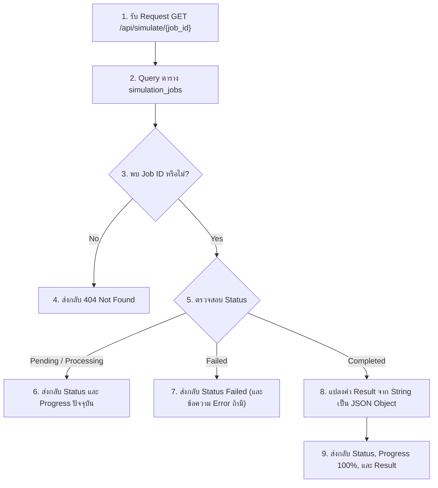

# แผนการพัฒนา: STORY-5 - สร้าง API สำหรับดึงสถานะงาน (Status Polling API)

## สรุป (Summary)
แผนการพัฒนานี้มุ่งเน้นการสร้าง API Endpoint `GET /api/simulate/{job_id}` สำหรับให้ฝั่งหน้าบ้าน (Frontend) สามารถดึงสถานะ (Polling) งานจำลอง Cache ที่กำลังทำงานอยู่เบื้องหลังได้ โดย API จะคืนค่าสถานะปัจจุบัน (Status), เปอร์เซ็นต์ความคืบหน้า (Progress) และผลลัพธ์ (Result) ของการจำลองหากงานเสร็จสมบูรณ์ เพื่อนำไปแสดงผลบน Progress Bar และหน้าจอสรุปผล

## เรื่องราวของผู้ใช้งาน (User Story)
ในฐานะนักพัฒนาหน้าบ้าน (Frontend developer)
ฉันต้องการ API สำหรับดึงสถานะงานที่กำลังประมวลผล
เพื่อนำไปแสดงผลบนแถบ Progress bar ให้ผู้ใช้เห็นและแสดงผลสรุปเมื่อเสร็จสิ้น

## ข้อมูลเบื้องต้น (Metadata)
| Field | Value |
|-------|-------|
| ประเภท (Type) | NEW_CAPABILITY |
| ความซับซ้อน (Complexity) | SMALL |
| ระบบที่เกี่ยวข้อง (Systems Affected) | backend (API, DB) |
| Jira Issue | STORY-5 |
| Source Control | พัฒนาบน `main` branch ได้เลย ไม่ต้องสร้าง branch ใหม่ |

---

## คุณสมบัติและรูปแบบการทำงาน (Features & I/O)

### ฟีเจอร์ที่รองรับ (Features)
1. **Status Polling API**: รองรับการตรวจสอบสถานะและเปอร์เซ็นต์ความคืบหน้าด้วย Job ID
2. **Result Delivery**: คืนค่าผลการจำลองรวม (Hit Rate, Miss Rate, Total Accesses) หากประมวลผลสำเร็จ
3. **Error Handling**: จัดการกรณีไม่พบ Job ID ในระบบให้ตอบกลับด้วย HTTP 404

### รูปแบบข้อมูล (Input / Process / Output)
- **Input (API Request)**:
  - Path Parameter: `job_id` (String / UUID)
- **Process**:
  1. ค้นหาแถวข้อมูลจากตาราง `simulation_jobs` โดยใช้ `job_id`
  2. หากไม่พบ คืนค่า `404 Not Found`
  3. หากพบ อ่านค่า `status`, `progress` และ `result`
  4. หาก `result` มีข้อมูลอยู่ (ตอน Completed) ให้อนุกรม (Parse) JSON จาก Text กลับเป็น Object
- **Output (API Response)**:
  - กรณีงานกำลังประมวลผล:
    ```json
    {
      "job_id": "uuid-string",
      "status": "Processing",
      "progress": 45,
      "result": null
    }
    ```
  - กรณีงานเสร็จสิ้น:
    ```json
    {
      "job_id": "uuid-string",
      "status": "Completed",
      "progress": 100,
      "result": {
        "hits": 450000,
        "misses": 550000,
        "hit_rate": 45.0,
        "miss_rate": 55.0
      }
    }
    ```

---

## Workflow (แผนผังการทำงาน)



---

## ไฟล์ที่ต้องเปลี่ยนแปลง (Files to Change)

| ไฟล์ (File) | การกระทำ (Action) | วัตถุประสงค์ (Purpose) |
|------|--------|---------|
| `backend/main.py` | UPDATE | สร้าง Endpoint `GET /api/simulate/{job_id}` สำหรับดึงข้อมูลจาก Database |
| `backend/tests/test_api.py` | UPDATE | เพิ่ม Unit Test กรณีเจอ Job ID และกรณีไม่เจอ Job ID (404) |

---

## งานที่ต้องทำ (Tasks)

### Task 1: สร้าง API Endpoint สำหรับ Status Polling
- **ไฟล์ (File)**: `backend/main.py`
- **การทำงาน (Implement)**:
  - นำเข้า (Import) dependencies สำหรับ Database Session และ โมเดล `SimulationJob`
  - ประกาศ API Endpoint `GET /api/simulate/{job_id}`
  - ดึงข้อมูล `db.query(SimulationJob).filter_by(id=job_id).first()`
  - จัดการกรณียกเว้น: `raise HTTPException(status_code=404, detail="Job not found")` หากได้ผลลัพธ์เป็น `None`
  - คืนค่า (Return) โครงสร้างข้อมูล (Dictionary) ประกอบด้วย `job_id`, `status`, `progress`, และ `result`
  - ตรวจสอบว่าถ้า `result` ไม่ใช่ `None` ให้ทำการอ่านค่าด้วย `json.loads(job.result)` ก่อนบรรจุลงใน Response เพื่อไม่ให้ถูกเข้ารหัส String ซ้อนกันสองชั้น

### Task 2: เขียน Unit Test ตรวจสอบ API 
- **ไฟล์ (File)**: `backend/tests/test_api.py`
- **การทำงาน (Implement)**:
  - สร้าง TestCase 1: จำลอง Job ID ปลอม (เช่น `"non-existent-id"`) ต้องได้ Status Code 404
  - สร้าง TestCase 2: ทำการ Insert ข้อมูล Job แบบจำลองเข้าไปใน DB ชั่วคราว (กำหนด Status: "Completed", Result: `{"hits": 1}`) และทดสอบเรียกผ่าน `TestClient` จากนั้นยืนยันว่าข้อมูลส่งกลับมาในรูปแบบ JSON Object ได้ถูกต้อง 

---

## เกณฑ์การยอมรับ (Acceptance Criteria)
- [ ] Endpoint `GET /api/simulate/{job_id}` ถูกสร้างขึ้นและตอบสนองได้รวดเร็ว
- [ ] หาก Job ID ไม่มีอยู่จริง ระบบแจ้ง `404 Not Found` กลับไปอย่างเหมาะสม
- [ ] ข้อมูลที่ตอบกลับมีโครงสร้างชัดเจน ประกอบด้วย `job_id`, `status`, `progress`
- [ ] เมื่อสถานะเป็น "Completed" API สามารถอ่านค่า `result` และส่งกลับในรูปแบบ JSON Object ได้อย่างถูกต้อง ไม่ใช่ String เปล่าๆ
