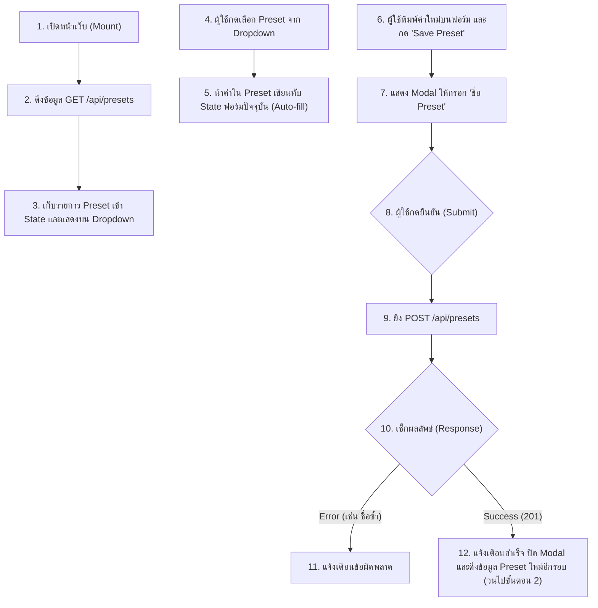

# แผนการพัฒนา: STORY-12 - เมนูเลือก Preset (Preset Selection UI)

## สรุป (Summary)
แผนการพัฒนานี้ครอบคลุมการสร้างส่วนติดต่อผู้ใช้ (UI) บนหน้าเว็บสำหรับจัดการ **Preset (ค่าการตั้งค่าล่วงหน้า)** โดยผู้ใช้ (ส่วนใหญ่คืออาจารย์) จะสามารถกดเลือก Preset ที่มีอยู่แล้วจาก Dropdown เพื่อให้ระบบเติมตัวเลข Cache Size, Block Size หรือ Mapping Type ลงในแบบฟอร์มโดยอัตโนมัติ (Auto-fill) รวมถึงสามารถกดปุ่ม "Save Preset" เพื่อบันทึกการตั้งค่าที่กรอกค้างอยู่ในปัจจุบันเป็น Preset ใหม่ โดยจะเชื่อมต่อกับ API ของระบบ Backend ที่ถูกสร้างไว้แล้วใน STORY-11

## เรื่องราวของผู้ใช้งาน (User Story)
ในฐานะอาจารย์ผู้สอน
ฉันต้องการหน้า UI สำหรับกดเลือก, หรือสร้าง ค่า Preset ที่ถูกบันทึกไว้
เพื่อจะได้ดึงข้อมูล Cache ที่ต้องใช้สาธิตมาใส่ในช่องกรอกได้อย่างรวดเร็ว ไม่ต้องพิมพ์ใหม่ทุกรอบ

## ข้อมูลเบื้องต้น (Metadata)
| Field | Value |
|-------|-------|
| ประเภท (Type) | NEW_CAPABILITY |
| ความซับซ้อน (Complexity) | SMALL |
| ระบบที่เกี่ยวข้อง (Systems Affected) | frontend (UI Components) |
| Jira Issue | STORY-12 |
| Source Control | พัฒนาบน `main` branch ได้เลย ไม่ต้องสร้าง branch ใหม่ |

---

## คุณสมบัติและรูปแบบการทำงาน (Features & I/O)

### ฟีเจอร์ที่รองรับ (Features)
1. **Preset Dropdown Selector**: เมนู Dropdown ที่ดึงข้อมูล Preset ล่าสุดจากเซิร์ฟเวอร์มาแสดง เมื่อกดเลือก ระบบจะเติมค่าลงแบบฟอร์ม (Form Auto-fill) ทันที
2. **Save Preset Dialog**: ปุ่มสำหรับบันทึกการตั้งค่าปัจจุบัน เมื่อกดแล้วจะขึ้น Popup (Modal) ถามชื่อ Preset ที่ต้องการตั้ง 
3. **API Integration**: ผูก UI เข้ากับคำสั่ง Fetch เพื่อยิง `GET /api/presets` และ `POST /api/presets`

### รูปแบบข้อมูล (Input / Process / Output)
- **Input**:
  - การโต้ตอบจากผู้ใช้: กดเลือก Dropdown, กดปุ่ม Save, และพิมพ์ชื่อ Preset ใหม่
- **Process**:
  1. ทันทีที่เปิดหน้าเว็บ สั่ง Fetch `GET /api/presets` นำ Array มาเก็บใน State (`presets`)
  2. เมื่อผู้ใช้เลือก Dropdown -> นำ Object ของ Preset นั้นมาเซ็ตทับ State ของแบบฟอร์ม (จาก STORY-6)
  3. เมื่อผู้ใช้กดบันทึก -> ดึงข้อมูลในฟอร์มปัจจุบัน ส่งคู่กับชื่อใหม่ไปที่ `POST /api/presets`
  4. หากบันทึกสำเร็จ ให้ดึงข้อมูล `GET /api/presets` ใหม่อีกรอบเพื่ออัปเดต Dropdown
- **Output**:
  - การเติมข้อมูลอัตโนมัติลงในแบบฟอร์ม
  - ข้อความแจ้งเตือน (Toast / Alert) เมื่อเซฟ Preset สำเร็จ หรือเมื่อชื่อซ้ำ (Error 400)

---

## Workflow (แผนผังการทำงาน)

---

## ไฟล์ที่ต้องเปลี่ยนแปลง (Files to Change)

| ไฟล์ (File) | การกระทำ (Action) | วัตถุประสงค์ (Purpose) |
|------|--------|---------|
| `frontend/src/components/PresetManager.tsx` | CREATE | สร้าง Component เดี่ยวๆ สำหรับจัดการ Dropdown และปุ่ม Save Preset |
| `frontend/src/components/SimulationForm.tsx` | UPDATE | นำ `PresetManager` เข้ามาใช้งาน และเปิดให้มันสามารถเปลี่ยน State ของฟอร์มได้ |

---

## งานที่ต้องทำ (Tasks)

### Task 1: สร้าง Component ตัวจัดการ Preset
- **ไฟล์ (File)**: `frontend/src/components/PresetManager.tsx`
- **การทำงาน (Implement)**:
  - ใช้ `useEffect` ภายใน Component เพื่อดึงข้อมูล `GET /api/presets` เมื่อเริ่มต้น
  - สร้าง `<select>` สำหรับ Dropdown โดยลูป Array นำ `name` มาเป็น Text
  - สร้างฟังก์ชันรองรับ `onChange` ของ Dropdown แล้วส่ง Callback กลับไปหา Parent (`SimulationForm`) เพื่อเซ็ตค่าฟอร์มใหม่
  - สร้างปุ่ม "Save as Preset" และปุ่มนี้จะไปเรียก Modal (หรือใช้ `window.prompt` เบื้องต้น)

### Task 2: ผูกเข้ากับแบบฟอร์มหลัก
- **ไฟล์ (File)**: `frontend/src/components/SimulationForm.tsx`
- **การทำงาน (Implement)**:
  - แทรก `<PresetManager />` ไว้ด้านบนสุดของแบบฟอร์ม
  - สร้างฟังก์ชัน Callback (เช่น `handleApplyPreset`) และส่งให้ `PresetManager` เพื่อรับค่าอัปเดตและสั่ง `setFormData(...)`
  - สร้างฟังก์ชันส่งกลับค่า State การตั้งค่าปัจจุบัน (Cache Size, Block Size) ไปให้ `PresetManager` นำไปแพ็ครวมกับชื่อเพื่อส่ง `POST /api/presets`

### Task 3: ทดสอบการทำงาน (Integration Validation)
- **การทำงาน (Implement)**:
  - ลองสร้าง Preset ด้วยชื่อปกติ และทดสอบดึงค่ากลับมา
  - ลองบันทึกด้วยชื่อที่ซ้ำเดิม คาดหวังการแจ้งเตือน Error 400 ไม่ให้เว็บพัง
  - ลองเลือก Preset แล้วดูว่าตัวเลขในช่องเปลี่ยนทันทีตามที่ควรจะเป็นหรือไม่

---

## เกณฑ์การยอมรับ (Acceptance Criteria)
- [ ] มี Dropdown menu สำหรับกดเลือก Preset ที่มีอยู่ โดยข้อมูลในช่อง Input จะถูกเติมอัตโนมัติเมื่อกดเลือก
- [ ] มีปุ่ม "Save current configuration as Preset" เพื่อบันทึกค่าในช่องปัจจุบันเป็น Preset ใหม่บนฐานข้อมูล
- [ ] Preset ที่ดึงมาคงอยู่แม้จะรีเฟรชหรือโหลดหน้าเว็บใหม่ (เนื่องจากเชื่อมกับ Backend)
- [ ] สามารถรับมือและแสดงแจ้งเตือนได้หากชื่อ Preset ซ้ำกับที่มีอยู่แล้วในระบบ
