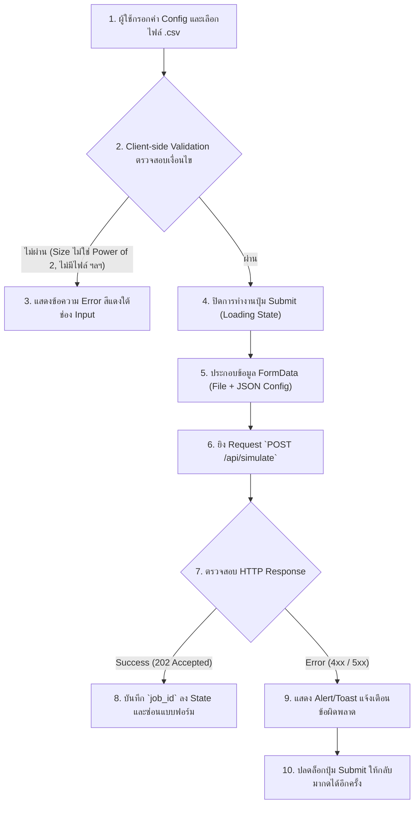

# แผนการพัฒนา: STORY-6 - หน้า UI สำหรับแบบฟอร์มและการตรวจสอบข้อมูล (Form Validation and Submission UI)

## สรุป (Summary)
แผนการพัฒนานี้ครอบคลุมการสร้างส่วนติดต่อผู้ใช้ (User Interface) ของระบบจำลอง Cache บนฝั่ง Frontend (Next.js) โดยจะมีแบบฟอร์มสำหรับรับค่าตัวแปรต่างๆ เช่น `Cache Size`, `Block Size`, รูปแบบ `Mapping Type` และไฟล์ `.csv` สิ่งสำคัญที่สุดคือระบบหน้าบ้านต้องมี **Form Validation** เพื่อตรวจสอบให้แน่ใจว่าค่า Size ต่างๆ เป็นตัวเลขแบบ **Power of 2 (2^n)** ก่อนที่จะยอมให้ผู้ใช้กดยืนยัน (Submit) และทำการส่งไปเรียก API ของ Backend

## เรื่องราวของผู้ใช้งาน (User Story)
ในฐานะผู้ใช้
ฉันต้องการให้ระบบหน้าบ้าน (UI) ตรวจสอบความถูกต้องของข้อมูล (เช่น Cache Size ต้องเป็น Power of 2) ก่อนกดยืนยัน 
เพื่อไม่ให้ฉันรันงานผิดพลาดและส่งผลให้ผลลัพธ์คลาดเคลื่อน หรือต้องรอโหลดข้อมูลฟรีโดยเปล่าประโยชน์

## ข้อมูลเบื้องต้น (Metadata)
| Field | Value |
|-------|-------|
| ประเภท (Type) | NEW_CAPABILITY |
| ความซับซ้อน (Complexity) | MEDIUM |
| ระบบที่เกี่ยวข้อง (Systems Affected) | frontend (Next.js, UI, API Integration) |
| Jira Issue | STORY-6 |
| Source Control | พัฒนาบน `main` branch ได้เลย ไม่ต้องสร้าง branch ใหม่ |

---

## คุณสมบัติและรูปแบบการทำงาน (Features & I/O)

### ฟีเจอร์ที่รองรับ (Features)
1. **Interactive Form**: แบบฟอร์มกรอกข้อมูลการตั้งค่า Cache ที่รองรับการซ่อน/แสดงฟิลด์แบบ Dynamic (เช่น ฟิลด์ N-way จะโผล่มาก็ต่อเมื่อเลือก Set-Associative)
2. **Power of 2 Validation**: ตัวตรวจสอบกฎ Power of 2 แบบ Real-time ทันทีที่ผู้ใช้พิมพ์
3. **File Uploader**: กล่องสำหรับเลือกไฟล์ (File Input) ที่อนุญาตเฉพาะไฟล์ `.csv`
4. **API Integration**: ผูกแบบฟอร์มเข้ากับการยิง API `POST /api/simulate` แบบ `multipart/form-data`

### รูปแบบข้อมูล (Input / Process / Output)
- **Input (User Interaction)**:
  - Text/Number Inputs: `cache_size`, `block_size`, `n_way`
  - Select/Dropdown: `mapping_type`
  - File Input: อัปโหลดไฟล์ Address list (.csv)
- **Process**:
  1. ตรวจสอบค่าในช่อง Input ฝั่งหน้าบ้าน (Client-side Validation)
  2. แปลง Config Object ไปเป็น JSON String เพื่อฝังไปกับ `FormData`
  3. ยิง `POST` ไปยัง `/api/simulate`
  4. แสดง Loading State บนปุ่ม Submit ป้องกันการกดซ้ำ
- **Output (API Response & State)**:
  - `job_id` ที่ได้รับจาก Backend จะถูกนำไปเก็บไว้ใน State ของ Component (เพื่อส่งต่อให้ STORY-7 นำไปทำ Progress Bar Polling)

---

## Workflow (แผนผังการทำงาน)

---

## ไฟล์ที่ต้องเปลี่ยนแปลง (Files to Change)

| ไฟล์ (File) | การกระทำ (Action) | วัตถุประสงค์ (Purpose) |
|------|--------|---------|
| `frontend/src/app/page.tsx` | UPDATE | ปรับแก้หน้าหลักให้รองรับการทำงานของฟอร์ม (หรือแบ่ง Component ย่อย) |
| `frontend/src/components/SimulationForm.tsx` | CREATE | สร้าง Component แยกสำหรับจัดการแบบฟอร์มโดยเฉพาะเพื่อความสะอาดของโค้ด |
| `frontend/src/utils/validation.ts` | CREATE | สร้างฟังก์ชันเช็ก Power of 2 (เช่น `isPowerOfTwo()`) ไว้เรียกใช้ซ้ำ |

---

## งานที่ต้องทำ (Tasks)

### Task 1: สร้าง Utilities ฝั่ง Frontend
- **ไฟล์ (File)**: `frontend/src/utils/validation.ts`
- **การทำงาน (Implement)**:
  - สร้างฟังก์ชัน `isPowerOfTwo(n: number): boolean` 
  - (ลอจิกคล้ายกับ C++: `return n > 0 && (n & (n - 1)) === 0;`)

### Task 2: สร้างและดีไซน์ Component `SimulationForm`
- **ไฟล์ (File)**: `frontend/src/components/SimulationForm.tsx`
- **การทำงาน (Implement)**:
  - สร้างแบบฟอร์มโดยใช้ HTML พื้นฐานพร้อมด้วย Tailwind CSS หรือใช้ไลบรารี UI ตามความเหมาะสม
  - แบ่งช่องรับข้อมูลเป็น 2 คอลัมน์ให้ดูสวยงาม
  - ใส่ฟังก์ชันตรวจสอบ `onChange` หรือใช้ (React Hook Form) ถ้า `mapping_type === "Set-Associative"` ให้แสดงช่อง `N-way`
  - หาก `isPowerOfTwo()` คืนค่า `false` ให้เรนเดอร์ข้อความ `
Must be a power of 2
` ใต้ช่องนั้น และ `disabled` ปุ่ม Submit

### Task 3: เชื่อมต่อ API (Fetch / Axios)
- **ไฟล์ (File)**: `frontend/src/components/SimulationForm.tsx`
- **การทำงาน (Implement)**:
  - สร้างฟังก์ชัน `handleSubmit` ที่รองรับ Event ของ Form
  - สร้างออบเจ็กต์ `FormData` นำไฟล์เข้าฟิลด์ `"file"` และ นำค่า Config แปลงเป็น String เข้าฟิลด์ `"config"`
  - `fetch("http://127.0.0.1:8000/api/simulate", { method: "POST", body: formData })`
  - นำ `job_id` ที่ได้มาโยนกลับขึ้นไปให้ Parent Component แจ้งให้ทราบเพิ่อเริ่มการรันหน้าต่าง Progress

---

## เกณฑ์การยอมรับ (Acceptance Criteria)
- [ ] มีแบบฟอร์มที่ประกอบด้วย Cache Size, Block Size, Mapping Type และ N-way (ถ้าจำเป็น)
- [ ] ระบบตรวจสอบข้อมูลบนหน้าเว็บจะไม่ยอมให้กดส่งแบบฟอร์ม หากค่า Size ต่างๆ ไม่ใช่ Power of 2 (และแสดง Error Message)
- [ ] แบบฟอร์มมีปุ่ม Input type="file" สำหรับอัปโหลดไฟล์ `.csv`
- [ ] เมื่อกด Submit สำเร็จแล้ว Frontend สามารถติดต่อ API ได้และนำ `job_id` มาใช้งานต่อได้อย่างถูกต้อง
