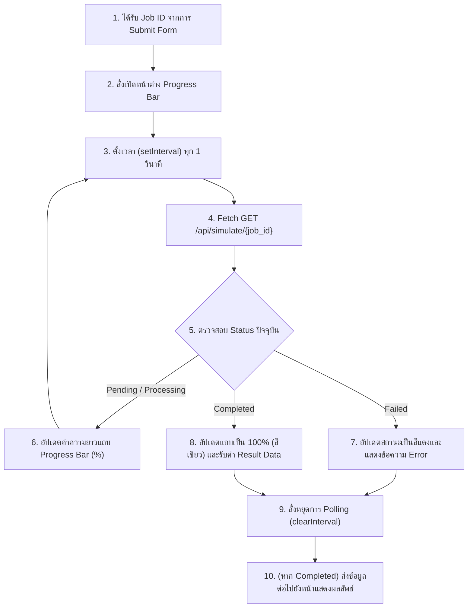

# แผนการพัฒนา: STORY-7 - แถบความคืบหน้า (Progress Bar UI - Polling)

## สรุป (Summary)
แผนการพัฒนานี้ครอบคลุมการสร้าง UI สำหรับแสดง **แถบความคืบหน้า (Progress Bar)** ในขณะที่ฝั่ง Backend กำลังรัน Simulation แบบพื้นหลัง (Background Worker) เมื่อได้รับ `job_id` มาจาก STORY-6 ระบบฝั่งหน้าบ้านจะเริ่มใช้เทคนิค **Polling** (ยิง API ไปถามสถานะซ้ำๆ ทุกๆ 1 วินาที) ไปยัง Endpoint `GET /api/simulate/{job_id}` (STORY-5) เพื่อนำตัวเลข `progress` มาขยับแถบความคืบหน้าแบบ Real-time จนกว่าสถานะจะเปลี่ยนเป็น `Completed` หรือ `Failed`

## เรื่องราวของผู้ใช้งาน (User Story)
ในฐานะนักศึกษา
ฉันต้องการเห็น Progress bar ระหว่างที่ระบบกำลังประมวลผลไฟล์ Address จำนวนมหาศาล
เพื่อให้ฉันรู้ว่าคอมพิวเตอร์ไม่ได้ค้างหรือพังไปแล้ว และประเมินเวลาที่รอได้

## ข้อมูลเบื้องต้น (Metadata)
| Field | Value |
|-------|-------|
| ประเภท (Type) | NEW_CAPABILITY |
| ความซับซ้อน (Complexity) | MEDIUM |
| ระบบที่เกี่ยวข้อง (Systems Affected) | frontend (Next.js, React Hooks) |
| Jira Issue | STORY-7 |
| Source Control | พัฒนาบน `main` branch ได้เลย ไม่ต้องสร้าง branch ใหม่ |

---

## คุณสมบัติและรูปแบบการทำงาน (Features & I/O)

### ฟีเจอร์ที่รองรับ (Features)
1. **Automated API Polling**: ระบบยิง API ซ้ำอัตโนมัติ (setInterval) แบบ Non-blocking
2. **Animated Progress Bar**: แถบแสดงเปอร์เซ็นต์ (0% - 100%) ที่เคลื่อนไหวตามข้อมูลที่ได้จาก API
3. **Status Indicator**: แสดงสถานะการทำงานปัจจุบันแบบข้อความ (เช่น Pending..., Processing 45%, Completed, Failed)
4. **Auto Stop Mechanism**: ระบบจัดการล้างคิว Polling อัตโนมัติเมื่อตรวจพบสถานะสิ้นสุดการทำงาน

### รูปแบบข้อมูล (Input / Process / Output)
- **Input (Props / State)**:
  - `jobId` (String): ได้รับมาจากฟอร์มการอัปโหลดไฟล์ (STORY-6)
- **Process**:
  1. Component เมาท์ (Mount) และพบว่ามี `jobId`
  2. เริ่มตั้งเวลาด้วย `setInterval` ให้ทำงานทุก 1-2 วินาที
  3. เรียก API `GET /api/simulate/{jobId}`
  4. อัปเดต State: `progress` (Number) และ `status` (String)
  5. หากพบว่า `status` คือ `Completed` หรือ `Failed` ให้สั่ง `clearInterval` ทันทีและนำผลลัพธ์ (`result`) ไปใช้ต่อ
- **Output (UI State / Render)**:
  - แถบ Progress สีสันสวยงาม (อิงจาก Tailwind CSS) 
  - หาก `Completed` จะมีการส่งต่อ Result Data ให้ Component ถัดไป (STORY-8)

---

## Workflow (แผนผังการทำงาน)



---

## รูปแบบที่ควรปฏิบัติตาม (Patterns to Follow)

### React useEffect Polling Pattern
```tsx
import { useEffect, useState } from 'react';

export function useSimulationPolling(jobId: string | null) {
  const [progress, setProgress] = useState(0);
  const [status, setStatus] = useState("Idle");
  const [result, setResult] = useState(null);

  useEffect(() => {
    if (!jobId) return;
    
    const interval = setInterval(async () => {
      try {
        const res = await fetch(`http://127.0.0.1:8000/api/simulate/${jobId}`);
        const data = await res.json();
        
        setProgress(data.progress);
        setStatus(data.status);
        
        if (data.status === "Completed" || data.status === "Failed") {
          setResult(data.result);
          clearInterval(interval);
        }
      } catch (err) {
        console.error("Polling error", err);
      }
    }, 1500); // 1.5 วินาที

    // Cleanup เมื่อ Component ถูกทำลาย
    return () => clearInterval(interval);
  }, [jobId]);

  return { progress, status, result };
}
```

---

## ไฟล์ที่ต้องเปลี่ยนแปลง (Files to Change)

| ไฟล์ (File) | การกระทำ (Action) | วัตถุประสงค์ (Purpose) |
|------|--------|---------|
| `frontend/src/hooks/useSimulationPolling.ts` | CREATE | สร้าง Custom Hook สำหรับจัดการตรรกะการ Polling ให้แยกตัวออกจาก UI |
| `frontend/src/components/ProgressBar.tsx` | CREATE | Component สำหรับวาด UI แถบความยาวและเปอร์เซ็นต์ |
| `frontend/src/app/page.tsx` | UPDATE | เชื่อม Component เข้าด้วยกัน และจ่ายตัวแปร `jobId` ให้ `ProgressBar` เมื่อกด Submit ฟอร์มเสร็จ |

---

## งานที่ต้องทำ (Tasks)

### Task 1: สร้าง Custom Hook จัดการการ Polling
- **ไฟล์ (File)**: `frontend/src/hooks/useSimulationPolling.ts`
- **การทำงาน (Implement)**:
  - เขียนฟังก์ชัน Hook ที่รับค่า `jobId: string | null` 
  - ใช้ `useEffect` ร่วมกับ `setInterval` ความถี่ทุกๆ 1.0 - 1.5 วินาที
  - ดึงข้อมูลจาก API ของ STORY-5 แล้วอัปเดต State `status`, `progress`, `result`
  - อย่าลืมเขียน Cleanup function `return () => clearInterval(...)` เพื่อป้องกัน Memory Leak

### Task 2: สร้างและสไตล์ลิสต์ Component ProgressBar
- **ไฟล์ (File)**: `frontend/src/components/ProgressBar.tsx`
- **การทำงาน (Implement)**:
  - รับ Props: `jobId` (หรือรับ `progress`, `status` แทนแล้วแต่การออกแบบ)
  - ใช้ Tailwind CSS วาดแถบเช่น `<div className="w-full bg-gray-200 rounded-full h-4"><div className="bg-blue-600 h-4 rounded-full transition-all duration-500" style={{ width: \`${progress}%\` }}></div></div>`
  - แสดงข้อความ Status เพื่อให้ผู้ใช้ทราบว่าระบบกำลังค้างอยู่ที่ขั้นตอนไหน

### Task 3: ประสาน Component และส่งต่อข้อมูล
- **ไฟล์ (File)**: `frontend/src/app/page.tsx`
- **การทำงาน (Implement)**:
  - หลังจาก Component `SimulationForm` ทำงานสำเร็จและส่ง `job_id` ขึ้นมาให้ State ของหน้าหลักแล้ว 
  - สั่งเปิด (Render) ตัว `ProgressBar` พร้อมส่งค่า `job_id` ไปให้
  - เมื่อ ProgressBar ดันจนเสร็จและได้รับค่า `result` จาก Hook แล้ว ให้เก็บ `result` ไว้ที่ State หลักเพื่อเตรียมส่งไปแสดงผลเป็นกราฟ / ตาราง ใน STORY ถัดไป (STORY-8)

---

## เกณฑ์การยอมรับ (Acceptance Criteria)
- [ ] เมื่อได้รับ `job_id` จากฟอร์ม ระบบหน้าเว็บจะเริ่มการ Polling ไปยัง `GET /api/simulate/{job_id}` ทุกๆ 1-2 วินาที โดยอัตโนมัติ
- [ ] แถบความคืบหน้าจะขยับตามเปอร์เซ็นต์และมีสีที่เปลี่ยนตามสถานะ เช่นสีน้ำเงินตอน Processing สีแดงเมื่อ Failed และสีเขียวเมื่อ Completed
- [ ] การ Polling จะหยุดแบบสมบูรณ์อัตโนมัติ (ไม่มีการรัวยิง API ต่อ) เมื่อสถานะเปลี่ยนเป็น Completed หรือ Failed
- [ ] มีการเก็บกวาดคิวเวลา (Interval Cleanup) เรียบร้อยเพื่อไม่ให้เว็บอืด
