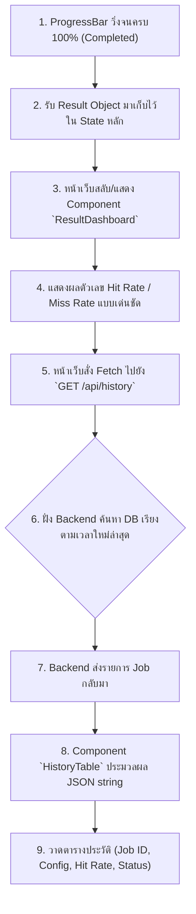

# แผนการพัฒนา: STORY-8 - หน้าแสดงผลลัพธ์และตารางประวัติ (Results Visualization and History Table)

## สรุป (Summary)
แผนการพัฒนานี้มีรายละเอียดเกี่ยวกับการสร้างส่วนแสดงผลลัพธ์ (Result UI) ให้ผู้ใช้เห็นความชัดเจนของ Hit Rate และ Miss Rate หลังจากการจำลองสิ้นสุดลง รวมถึงการสร้างตารางประวัติ (History Table) เพื่อแสดงผลการรันจำลองในอดีตทั้งหมด ช่วยให้ผู้ใช้สามารถเปรียบเทียบผลลัพธ์ระหว่างการตั้งค่า Cache ที่แตกต่างกันได้ นอกจากนี้จะต้องมีการสร้าง API Endpoint `GET /api/history` ฝั่ง Backend เพื่อดึงข้อมูลงานจำลองทั้งหมดมาแสดงบนตาราง

## เรื่องราวของผู้ใช้งาน (User Story)
ในฐานะผู้ใช้
ฉันต้องการดูผลการจำลองที่เพิ่งเสร็จสิ้น และประวัติการทดสอบในอดีตทั้งหมด
เพื่อเปรียบเทียบดูว่าการตั้งค่า Cache ที่ต่างกันให้ผลลัพธ์ (Hit Rate) ที่แตกต่างกันอย่างไรบนไฟล์หรือโหลดเดียวกัน

## ข้อมูลเบื้องต้น (Metadata)
| Field | Value |
|-------|-------|
| ประเภท (Type) | NEW_CAPABILITY |
| ความซับซ้อน (Complexity) | MEDIUM |
| ระบบที่เกี่ยวข้อง (Systems Affected) | frontend (UI), backend (API) |
| Jira Issue | STORY-8 |
| Source Control | พัฒนาบน `main` branch ได้เลย ไม่ต้องสร้าง branch ใหม่ |

---

## คุณสมบัติและรูปแบบการทำงาน (Features & I/O)

### ฟีเจอร์ที่รองรับ (Features)
1. **Result Dashboard**: กรอบแสดงผลลัพธ์ตัวเลขขนาดใหญ่ (Big Numbers) สำหรับ Hit Rate, Miss Rate และจำนวนการเข้าถึงข้อมูล (Total Accesses)
2. **Data Visualization (Graphs)**: นำไลบรารี `react-chartjs-2` หรือ `recharts` มาสร้างกราฟ 
   - **Pie/Bar Chart** แสดงสัดส่วน Hits vs Misses ของงานล่าสุด
   - **Line/Bar Chart** แสดแนวโน้ม Hit Rate จากประวัติการจำลองในตาราง History
3. **History API (`GET /api/history`)**: Endpoint ใหม่ที่ใช้ดึงงานจำลองทั้งหมดจากตาราง `simulation_jobs` เรียงตามเวลาใหม่ล่าสุด 
4. **History Table UI**: ตารางบนหน้าเว็บสำหรับแสดงประวัติการทำงาน โดยแสดง ID ของงาน, การตั้งค่าที่ใช้ (Cache Size, Block Size ฯลฯ), สถานะ (Completed, Failed), และ Hit Rate %

### รูปแบบข้อมูล (Input / Process / Output)
- **Input (API Request)**:
  - Frontend ใช้คำสั่ง `fetch` ยิง `GET /api/history` ไปยังเซิร์ฟเวอร์
- **Process**:
  1. Backend รันคำสั่ง Query: `db.query(SimulationJob).order_by(desc(created_at)).all()`
  2. Frontend รับข้อมูล Array ของ Job กลับมา
  3. Frontend แปลง JSON String ที่อยู่ในฟิลด์ `result` ให้อยู่ในรูป Object เพื่อดึงค่า `hit_rate` และ `config` (ค่าการตั้งค่าที่ถูกแพครวมไปตอนที่งานเสร็จสิ้น) ออกมา
- **Output (API Response)**:
  ```json
  [
    {
      "id": "uuid-1",
      "status": "Completed",
      "progress": 100,
      "result": {
        "hit_rate": 85.5,
        "config": { "cache_size": 32, "block_size": 64 }
      },
      "created_at": "2026-07-25T10:00:00"
    }
  ]
  ```

---

## Workflow (แผนผังการทำงาน)



---

## ไฟล์ที่ต้องเปลี่ยนแปลง (Files to Change)

| ไฟล์ (File) | การกระทำ (Action) | วัตถุประสงค์ (Purpose) |
|------|--------|---------|
| `backend/main.py` | UPDATE | เพิ่ม Endpoint `GET /api/history` |
| `frontend/src/components/ResultDashboard.tsx` | CREATE | สร้าง Component เพื่อแสดงผลลัพธ์หลังจากโหลดเสร็จ |
| `frontend/src/components/HistoryTable.tsx` | CREATE | สร้าง Component รูปแบบตารางเพื่อดึงและแสดงผลจาก `/api/history` |
| `frontend/src/app/page.tsx` | UPDATE | ประกอบสอง Component ใหม่เข้าไปในหน้าหลัก |

---

## งานที่ต้องทำ (Tasks)

### Task 1: สร้าง Endpoint ดึงประวัติที่ Backend
- **ไฟล์ (File)**: `backend/main.py`
- **การทำงาน (Implement)**:
  - สร้าง Endpoint `GET /api/history`
  - ใช้ Session Query โมเดล `SimulationJob` ด้วยคำสั่ง `order_by(SimulationJob.created_at.desc())` แบบจำกัด 50 แถวล่าสุด (Limit 50) เพื่อลดภาระการโหลด
  - จัดการ Parse JSON ในฟิลด์ `result` คล้ายกับที่ทำใน `GET /api/simulate/{job_id}` แล้วส่งกลับไปเป็น Array

### Task 2: สร้างและสไตล์ลิสต์ Component ตารางประวัติ (History Table)
- **ไฟล์ (File)**: `frontend/src/components/HistoryTable.tsx`
- **การทำงาน (Implement)**:
  - ใช้ `useEffect` ภายใน Component นี้เพื่อ Fetch ข้อมูลจาก `GET /api/history` ทันทีที่ Component ถูกเรนเดอร์
  - วาด `<table>` ด้วย Tailwind CSS (เช่นมี Border, Header สวยงาม และ Hover effect)
  - คอลัมน์ที่ต้องมี: Date, Configuration (เอาจาก `result.config`), Status (สีตัวอักษรเปลี่ยนตามคำว่า Completed หรือ Failed), และ Hit Rate

### Task 3: สร้าง Component สรุปผลและกราฟ (Result Dashboard & Charts)
- **ไฟล์ (File)**: `frontend/src/components/ResultDashboard.tsx`
- **การทำงาน (Implement)**:
  - รับ Props เป็นข้อมูล `result` ที่ได้มาจากการจำลองรอบปัจจุบัน 
  - สร้างการ์ด (Cards) สำหรับ: **Hit Rate (%)**, **Miss Rate (%)**, และ **Total Accesses**
  - ติดตั้งไลบรารีกราฟ (เช่น `npm install chart.js react-chartjs-2`)
  - นำข้อมูล `hits` และ `misses` มาวาดลงใน **Pie Chart หรือ Bar Chart** เพื่อให้เห็นสัดส่วนความต่างชัดเจนคล้ายระบบเดิม

### Task 4: ประกอบเข้าด้วยกันและจัดการ State ในหน้าหลัก
- **ไฟล์ (File)**: `frontend/src/app/page.tsx`
- **การทำงาน (Implement)**:
  - เมื่อ `useSimulationPolling` (จาก STORY-7) แจ้งว่าสถานะ `Completed` ให้แสดง `<ResultDashboard result={result} />` ทับ หรือต่อจาก ProgressBar 
  - สั่งให้ `<HistoryTable />` อยู่ด้านล่างของหน้าจอ และใส่ Key / Trigger ให้ History Table รีเฟรชตัวเองดึงข้อมูลใหม่ทันทีที่งานล่าสุดรันเสร็จ

---

## เกณฑ์การยอมรับ (Acceptance Criteria)
- [ ] เมื่อจำลองผลเสร็จสิ้น หน้าเว็บจะแสดงเปอร์เซ็นต์ Hit Rate, Miss Rate และ Total Accesses ได้อย่างเด่นชัด
- [ ] มี Endpoint `GET /api/history` บน Backend ที่ส่งประวัติการจำลองทั้งหมดในรูปแบบ Array
- [ ] หน้าเว็บมี Component ตารางที่ดึงข้อมูลจาก API มาแสดงผล Configuration และ Hit Rate ได้ถูกต้อง
- [ ] ตารางมีการอัปเดตข้อมูลอัตโนมัติ หรือง่ายต่อการให้ผู้ใช้เรียกดูเมื่อจำลองข้อมูลรอบใหม่เสร็จ
