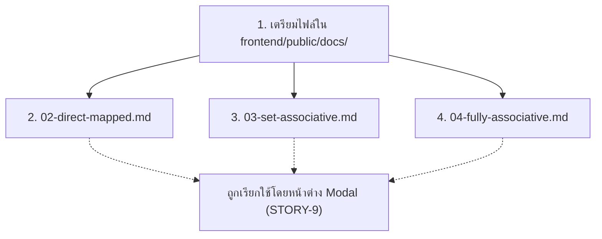

# แผนการพัฒนา: STORY-10 - จัดเตรียมเนื้อหา Markdown (Create Educational Markdown Content)

## สรุป (Summary)
แผนการพัฒนานี้ครอบคลุมการจัดเตรียมเอกสารความรู้เรื่อง Cache Mapping ในรูปแบบไฟล์ Markdown (`.md`) เพื่อให้ Component `MarkdownModal` (ที่ถูกสร้างใน STORY-9) ดึงข้อมูลไปแสดงผลได้อย่างถูกต้อง **โดยผู้ใช้ (User) ได้ทำการสร้างเนื้อหาไฟล์ Markdown และรูปภาพอธิบายทฤษฎีไว้ล่วงหน้าเรียบร้อยแล้วทั้งหมด 4 ไฟล์ภายในโฟลเดอร์ `public/docs/`**

## เรื่องราวของผู้ใช้งาน (User Story)
ในฐานะผู้สอน
ฉันต้องการจัดเตรียมไฟล์ Markdown และรูปภาพอธิบายทฤษฎี Cache ไว้ในโฟลเดอร์ `/public` 
เพื่อให้หน้าต่าง Popup มีเนื้อหาที่สมบูรณ์และถูกต้องสำหรับนำไปใช้แสดงผลให้นักศึกษาอ่าน

## ข้อมูลเบื้องต้น (Metadata)
| Field | Value |
|-------|-------|
| ประเภท (Type) | CONTENT_CREATION |
| ความซับซ้อน (Complexity) | SMALL |
| ระบบที่เกี่ยวข้อง (Systems Affected) | frontend (Static Files - `/public/docs`) |
| Jira Issue | STORY-10 |
| Source Control | พัฒนาบน `main` branch ได้เลย ไม่ต้องสร้าง branch ใหม่ |

---

## คุณสมบัติและเนื้อหาที่จัดเตรียมไว้แล้ว (Prepared Assets)

ผู้ใช้ได้เตรียมไฟล์ประกอบการให้ความรู้ไว้ดังนี้:
1. `frontend/public/docs/01-Cache-Memory.png` - รูปภาพประกอบ
2. `frontend/public/docs/02-direct-mapped.md` - เนื้อหาสำหรับ Direct Mapped
3. `frontend/public/docs/03-set-associative.md` - เนื้อหาสำหรับ Set-Associative
4. `frontend/public/docs/04-fully-associative.md` - เนื้อหาสำหรับ Fully Associative

### การปรับเปลี่ยนสถาปัตยกรรม (Architectural Adjustment)
เนื่องจากเรามีไฟล์เนื้อหาแยกตามประเภทของ Mapping Type (ไม่ได้รวมเป็นไฟล์เดียวเหมือนที่วางแผนไว้ตอนแรกใน STORY-9) ดังนั้น Component **`MarkdownModal` ใน STORY-9 จะต้องปรับโค้ดให้สอดคล้องกัน** คือ:
- รับค่า `mappingType` เป็น Props
- สลับ URL ที่จะ Fetch ตามประเภท เช่น:
  - หากเลือก Direct Mapped $\rightarrow$ `fetch('/docs/02-direct-mapped.md')`
  - หากเลือก Set-Associative $\rightarrow$ `fetch('/docs/03-set-associative.md')`
  - หากเลือก Fully Associative $\rightarrow$ `fetch('/docs/04-fully-associative.md')`

---

## Workflow (การนำไปใช้งาน)

---

## ไฟล์ที่ต้องเปลี่ยนแปลง (Files to Change)

| ไฟล์ (File) | การกระทำ (Action) | วัตถุประสงค์ (Purpose) |
|------|--------|---------|
| `frontend/public/docs/*.md` | DONE (โดยผู้ใช้) | จัดเตรียมไฟล์ Markdown อธิบายแต่ละทฤษฎีพร้อมตัวอย่างการคำนวณ |
| `frontend/public/docs/*.png` | DONE (โดยผู้ใช้) | จัดเตรียมรูปภาพประกอบ |

---

## งานที่ต้องทำ (Tasks)

เนื่องจากผู้ใช้ได้เขียนเนื้อหา Markdown (ไฟล์ `.md`) ให้เรียบร้อยแล้ว จึงไม่มีโค้ดที่ผมต้องไปเขียนใน STORY นี้อีก สิ่งที่ต้องทำต่อไปคือ:
1. **(รับทราบและบันทึก)** บันทึกการมีอยู่ของไฟล์เหล่านี้เพื่อนำไปผูกลอจิกในการเขียนโค้ดสำหรับ STORY-9

---

## เกณฑ์การยอมรับ (Acceptance Criteria)
- [x] สร้างไฟล์ Markdown อธิบายว่า "Cache Memory คืออะไร" (แยกย่อยตามไฟล์แล้ว)
- [x] สร้างไฟล์ Markdown อธิบายแต่ละเทคนิค: Direct Mapped, Fully Associative, Set-Associative
- [x] นำรูปภาพหรือไดอะแกรมมาใส่ใน Directory สาธารณะและระบุ Path ในไฟล์ Markdown ได้อย่างถูกต้อง
