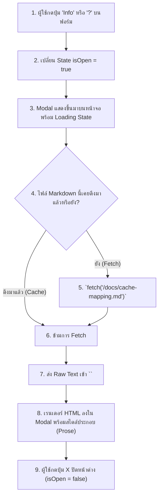

# แผนการพัฒนา: STORY-9 - หน้าต่างให้ความรู้แบบ Modal Popups (Educational Markdown Modal Popups)

## สรุป (Summary)
แผนการพัฒนานี้อยู่ใน Phase 4 ซึ่งมุ่งเน้นไปที่เนื้อหาเพื่อการศึกษา (Educational Content) โดยจะมีการสร้าง **Modal Popup** บนระบบหน้าบ้าน (Frontend) ที่เมื่อผู้ใช้คลิกปุ่ม "Info" ตัวระบบจะทำการดึงเนื้อหาจากไฟล์ Markdown (`.md`) ในแฟ้ม `public/` มาแสดงผล เพื่ออธิบายทฤษฎีเบื้องหลังการทำงานของ Cache Mapping ให้ผู้ใช้ (ซึ่งเป็นนักศึกษา) สามารถอ่านทำความเข้าใจเนื้อหาได้โดยไม่ต้องสลับหน้าจอไปมา

## เรื่องราวของผู้ใช้งาน (User Story)
ในฐานะนักศึกษา
ฉันต้องการปุ่ม "ข้อมูล (Info)" เมื่อกดแล้วจะแสดงหน้าต่าง Popup ทฤษฎีเรื่องเทคนิค Cache Mapping
เพื่อที่ฉันจะได้ทำความเข้าใจแนวคิดที่อยู่เบื้องหลังการจำลอง และนำไปประยุกต์ใช้ในการเรียนได้

## ข้อมูลเบื้องต้น (Metadata)
| Field | Value |
|-------|-------|
| ประเภท (Type) | NEW_CAPABILITY |
| ความซับซ้อน (Complexity) | MEDIUM |
| ระบบที่เกี่ยวข้อง (Systems Affected) | frontend (UI Components, Markdown Renderer) |
| Jira Issue | STORY-9 |
| Source Control | พัฒนาบน `main` branch ได้เลย ไม่ต้องสร้าง branch ใหม่ |

---

## คุณสมบัติและรูปแบบการทำงาน (Features & I/O)

### ฟีเจอร์ที่รองรับ (Features)
1. **Markdown Renderer**: นำไลบรารี `react-markdown` มาใช้แปลงโค้ดจากไฟล์ `.md` ให้กลายเป็น HTML เพื่อแสดงผลสวยงามบนหน้าเว็บ
2. **GFM Support**: รองรับส่วนขยาย `remark-gfm` ทำให้สามารถแสดงผลตาราง (Tables), ขีดฆ่า (Strikethrough) และ Checklist ได้สมบูรณ์
3. **Dynamic Fetching**: โหลดเนื้อหาจากไฟล์ `/markdown/mapping-theory.md` (จะถูกสร้างใน STORY-10) แบบ Asynchronous (ไม่ต้องแนบไปกับโค้ดหลัก ทำให้แก้เนื้อหาง่าย)
4. **Modal Window**: หน้าต่าง Popup ที่สามารถเลื่อนอ่าน (Scroll) ได้ และรองรับการแสดงรูปภาพ (Images) อย่างถูกต้อง

### รูปแบบข้อมูล (Input / Process / Output)
- **Input (User Action)**: ผู้ใช้คลิกปุ่ม `<button> ℹ️ Info</button>` บริเวณใกล้กับช่องเลือก `Mapping Type` ใน `SimulationForm`
- **Process**:
  1. Component เปลี่ยน State `isOpen` เป็น `true` เพื่อแสดง Modal
  2. Modal ทำการดึง (Fetch) ไฟล์ Markdown จาก URL เช่น `http://localhost:3000/docs/cache-mapping.md`
  3. `react-markdown` รับ Raw Text มาตีความ (Parse) เป็น HTML
- **Output (UI State)**: 
  - Modal แสดงบทความ รูปภาพ และตารางทฤษฎี
  - มีปุ่ม "ปิด (Close)" เพื่อซ่อน Modal

---

## Workflow (แผนผังการทำงาน)

---

## ไฟล์ที่ต้องเปลี่ยนแปลง (Files to Change)

| ไฟล์ (File) | การกระทำ (Action) | วัตถุประสงค์ (Purpose) |
|------|--------|---------|
| `frontend/src/components/MarkdownModal.tsx` | CREATE | สร้าง Component เดี่ยวสำหรับครอบหน้าต่าง Modal และการโหลดไฟล์ `.md` |
| `frontend/src/components/SimulationForm.tsx` | UPDATE | เพิ่มปุ่มกด Info นำไปวางข้างๆ Dropdown "Mapping Type" |
| `frontend/package.json` | UPDATE | ติดตั้ง `react-markdown` และ `remark-gfm` รวมถึงปลั๊กอินสำหรับ Styling (เช่น `@tailwindcss/typography`) |

---

## งานที่ต้องทำ (Tasks)

### Task 1: ติดตั้ง Libraries ที่จำเป็น
- **การทำงาน (Implement)**:
  - รันคำสั่ง `npm install react-markdown remark-gfm`
  - รันคำสั่ง `npm install -D @tailwindcss/typography` 
  - เข้าไปแก้ไข `tailwind.config.ts` ให้เรียกใช้ปลั๊กอิน `@tailwindcss/typography` เพื่อจะได้เรียกใช้คลาส `prose` ในการจัดสไตล์ตัวหนังสือให้สวยงาม

### Task 2: สร้าง Component `MarkdownModal`
- **ไฟล์ (File)**: `frontend/src/components/MarkdownModal.tsx`
- **การทำงาน (Implement)**:
  - รับ Props: `isOpen`, `onClose`, `markdownUrl` (เช่น `/docs/cache-mapping.md`)
  - ใช้ `useEffect` ภายในเพื่อสั่ง `fetch(markdownUrl).then(res => res.text())` แล้วเก็บผลลัพธ์ลง State `content`
  - วาด Layout หน้าต่าง Popup (มี Back-drop สีดำด้านหลังโปร่งแสง)
  - ภายในกล่อง Modal วางแท็ก `<ReactMarkdown remarkPlugins={[remarkGfm]} className="prose">{content}</ReactMarkdown>`

### Task 3: ประสานเข้ากับฟอร์มหลัก
- **ไฟล์ (File)**: `frontend/src/components/SimulationForm.tsx`
- **การทำงาน (Implement)**:
  - วางปุ่มไอคอนตัว "i" หรือ "Info" ไว้ข้างๆ ฟิลด์ `Mapping Type`
  - เมื่อคลิกให้สั่ง `setModalOpen(true)`
  - ฝัง Component `<MarkdownModal isOpen={isModalOpen} onClose={() => setModalOpen(false)} markdownUrl="/docs/cache-mapping.md" />` ลงในโครงสร้าง
  - *(เตรียมไฟล์ Mock `.md` เปล่าๆ ชื่อ `cache-mapping.md` ไว้ในโฟลเดอร์ `public/docs/` เพื่อป้องกัน Fetch Error รอ STORY-10 มาเติมเนื้อหา)*

---

## เกณฑ์การยอมรับ (Acceptance Criteria)
- [ ] ปุ่ม "Info" ถูกวางไว้ใกล้กับจุดให้เลือกรูปแบบ Cache Mapping 
- [ ] เมื่อกดปุ่ม หน้าต่าง Modal แบบ Popup เด้งขึ้นมาตรงกลางหน้าจอ พร้อมแบคดรอป
- [ ] Modal นี้สามารถใช้งาน `react-markdown` ในการนำเข้าเนื้อหาจากไฟล์ `.md` ภายในโฟลเดอร์ `public/` มาแสดงผลได้อย่างสวยงาม
- [ ] หากมีตารางหรือรูปภาพในไฟล์ Markdown ข้อมูลเหล่านั้นต้องแสดงผลภายใน Modal ได้อย่างสมบูรณ์และถูกต้อง (รองรับ GFM)
