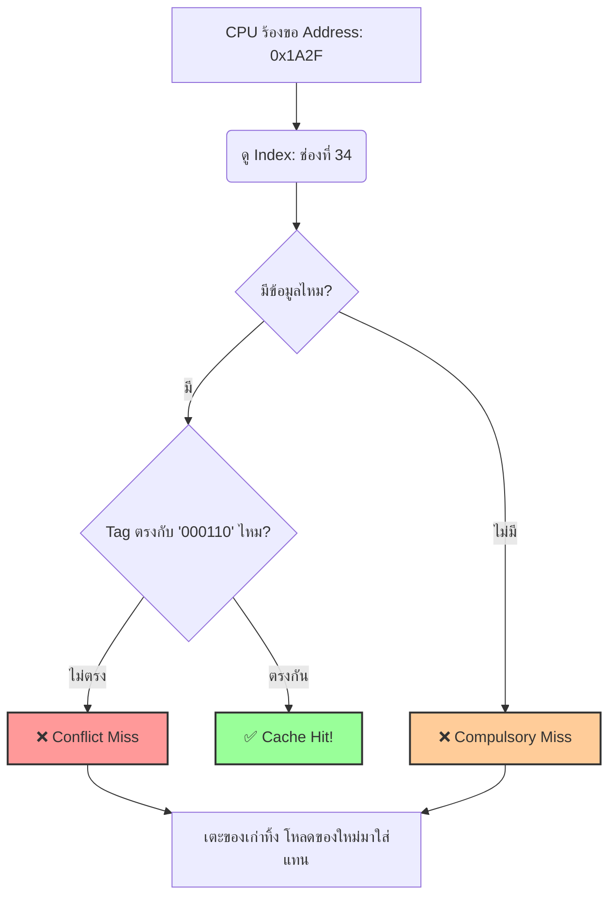

# 📍 Direct Mapped Cache: การจับคู่แบบ 1-to-1

## 💡 แนวคิดหลัก: การจับคู่แบบ 1-to-1 (One-to-One Mapping)

ถ้าเปรียบเทียบ Cache เป็น "ลานจอดรถ" ระบบ **Direct Mapped** ก็คือลานจอดรถที่มีกฎเหล็กว่า *"ตั๋วรถของคุณระบุให้จอดช่องไหน คุณต้องจอดช่องนั้นเท่านั้น ห้ามจอดช่องอื่นเด็ดขาด!"* กลไกนี้คือการนำข้อมูลจาก Main Memory มาจับคู่ (Mapping) เข้ากับตำแหน่งใน Cache แบบ **1-to-1** (ตำแหน่งต่อตำแหน่งตายตัว) โดยใช้ **Index** จาก Memory Address เป็นตัวบอกตำแหน่ง หากช่องนั้นมีข้อมูลอื่นอยู่ก่อนแล้ว ระบบจะทำการเตะข้อมูลเก่าทิ้ง (Evict) และเอาข้อมูลใหม่ใส่เข้าไปแทนที่ทันทีครับ

---

## 🧩 วิธีการคำนวณ Tag, Index, Offset อย่างง่าย (The Math Behind It)

เพื่อให้เห็นภาพชัดเจน เรามาลองคำนวณหาจำนวน Bits ของแต่ละส่วนกันครับ สมมติว่าระบบของเรากำหนดสเปคไว้ดังนี้:

* **Memory Address:** ขนาด 16 bits
* **Cache Size (ความจุทั้งหมด):** 1024 Bytes (1 KB)
* **Block Size (ขนาดต่อบล็อก):** 16 Bytes

**ขั้นตอนที่ 1: หาจำนวน Cache Lines (ช่องจอดรถ)**

* `Cache Lines = Cache Size / Block Size`
* `1024 / 16 = 64 Lines` (แปลว่า Cache นี้มีช่องให้เก็บข้อมูลได้ 64 ช่อง)

**ขั้นตอนที่ 2: แบ่ง Bits (Decomposition)**

1. **Offset:** Block Size คือ 16 Bytes ($2^4$) $\rightarrow$ ใช้ **4 bits**
2. **Index:** มี 64 Cache Lines ($2^6$) $\rightarrow$ ใช้ **6 bits**
3. **Tag:** ส่วนที่เหลือ (16 - 4 - 6) $\rightarrow$ ใช้ **6 bits**

> **สรุปโครงสร้าง:** Tag (6 bits) | Index (6 bits) | Offset (4 bits)

---

## 🔢 ตัวอย่างการสกัดข้อมูลจาก Address

**โจทย์:** CPU ต้องการดึงข้อมูลที่ Hex Address `0x1A2F`

1. แปลงเป็นเลขฐานสอง (16 bits):

$$0x1A2F = 0001\ 1010\ 0010\ 1111_{2}$$

2. หั่นชิ้นส่วนตามโครงสร้างด้านบน:
* **Tag (6 bits หน้า):** `000110` (นำไปเทียบกับป้ายชื่อใน Cache)
* **Index (6 bits กลาง):** `100010` (แปลงเป็นฐานสิบคือ 34 $\rightarrow$ CPU จะวิ่งไปดูที่ช่องหมายเลข 34 ทันที!)
* **Offset (4 bits หลัง):** `1111` (ตำแหน่งข้อมูลย่อยที่ 15 ในบล็อก)

---

## ⚙️ กลไกการทำงานเมื่อเกิด Cache Hit และ Cache Miss

สำหรับ Direct Mapped ลำดับการตรวจสอบจะตรงไปตรงมาและรวดเร็วมาก:

> 💡 **ข้อสังเกต:** เนื่องจาก Direct Mapped มีตำแหน่งให้ลงล็อกแบบตายตัวอยู่แล้ว ระบบจึง **ไม่มีความจำเป็นต้องใช้นโยบายการแทนที่ข้อมูล (Replacement Policy อย่าง LRU หรือ FIFO)** เลยครับ ชนปุ๊บ เตะปั๊บ!

---

## ⚖️ ข้อดี และ ข้อเสีย (Pros & Cons)

| ข้อดี (Pros) | ข้อเสีย (Cons) |
| --- | --- |
| **ความเร็วแสง:** ค้นหาเจอไวที่สุด เพราะเช็คแค่ Index ช่องเดียวรู้ผลทันที ไม่ต้องวนลูปหา | **Conflict Miss สูง:** หากโปรแกรมเรียกใช้ Address 2 ตัวที่มี Index ชนกัน มันจะเตะกันออกสลับไปมาเรื่อยๆ (เรียกว่าอาการ Thrashing) |
| **ออกแบบง่าย:** โครงสร้าง Hardware ไม่ซับซ้อน ทำให้ประหยัดพื้นที่และพลังงาน | **ใช้พื้นที่ไม่คุ้มค่า:** ช่องอื่นใน Cache อาจจะว่างเปล่า แต่ถ้า Index ชนกัน ระบบก็ไม่ยอมไปใช้ช่องที่ว่างอยู่ดี |
| **ไม่ต้องมี Replacement Policy:** ลดภาระการคำนวณและเก็บ State | **Hit Rate มักจะต่ำกว่า** สถาปัตยกรรมแบบ Set-Associative |

---

### 📚 แหล่งข้อมูลอ้างอิง
* กลไกการเกิด Conflict Miss สอดคล้องกับหลักการวิเคราะห์จากหนังสือ *Computer Organization and Design* (Patterson & Hennessy)