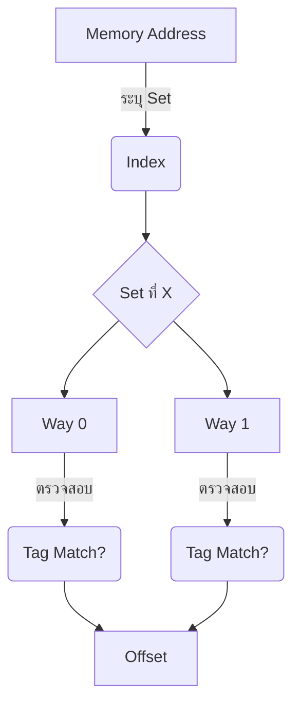

# 🗂️ Set-Associative Cache: ทางสายกลางที่ลงตัว

## 💡 แนวคิดพื้นฐานและหน้าที่ (Concept & Purpose)

ในบทที่แล้ว เราเห็นจุดอ่อนของ Direct Mapped ที่ให้จอดรถได้แค่ช่องเดียวแบบ 1-to-1 ซึ่งทำให้เกิดการแย่งที่จอดกันบ่อย (Conflict Miss) เพื่อแก้ปัญหานี้ วิศวกรจึงคิดค้น **Set-Associative Cache** ขึ้นมาครับ!

เปรียบเทียบง่ายๆ มันคือลานจอดรถที่ **"แบ่งเป็นโซน (Set)"** โดยตั๋วของคุณจะระบุแค่ว่าต้องไปจอดที่ "โซนไหน" แต่เมื่อไปถึงโซนนั้นแล้ว คุณสามารถเลือกจอดใน "ช่องว่าง (Way) ช่องไหนก็ได้" ภายในโซนนั้น

รูปแบบนี้มักจะเรียกตามจำนวนช่องในแต่ละ Set เช่น:
**2-Way Set-Associative:** ใน 1 Set มีช่องให้เก็บข้อมูลได้ 2 ช่อง (ข้อมูลลงล็อกที่ Set นี้ สามารถเลือกวางได้ 2 ที่) 
**4-Way Set-Associative:** ใน 1 Set มีช่องให้เก็บข้อมูลได้ 4 ช่อง 

---

## 🧩 โครงสร้างการแบ่ง Address Bits (Decomposition)

การหั่น Memory Address จะคล้ายกับ Direct Mapped แต่มีจุดแตกต่างสำคัญคือ **Index จะไม่ได้ชี้ไปที่ช่องเดี่ยวๆ อีกต่อไป แต่จะชี้ไปที่ "หมายเลข Set" แทน** 

* **Tag:** ใช้เป็นป้ายชื่อตรวจสอบความถูกต้อง (เนื่องจากใน 1 Set มีหลายช่อง ระบบต้องนำ Tag ไปเทียบกับทุกช่องใน Set นั้นพร้อมๆ กัน)
* **Index (Set Index):** ใช้ระบุว่าต้องไปค้นหาข้อมูลที่ "Set หมายเลขอะไร"
* **Offset:** ใช้ระบุตำแหน่งข้อมูลย่อยภายใน Block

**แผนภาพจำลอง (Mermaid Diagram):**

---

## ⚙️ กลไกการทำงานเมื่อเกิด Cache Hit และ Cache Miss (และนโยบาย LRU)

การทำงานของ Set-Associative จะมีความซับซ้อนขึ้นเล็กน้อยเมื่อ Set เต็ม:

1. **✅ ค้นหาและเจอ (Cache Hit):** CPU วิ่งไปที่ Set ตาม Index จากนั้นเทียบ Tag กับทุก Way ใน Set นั้น หากตรงกันก็นำข้อมูลไปใช้ได้เลย
2. **❌ ค้นหาไม่เจอ (Cache Miss):** หากใน Set นั้นยังมี Way ว่างอยู่ ก็ดึงข้อมูลจาก RAM มาใส่ในช่องว่างได้เลย
3. **♻️ เมื่อ Set เต็ม (Replacement Policy):** หาก CPU ต้องนำข้อมูลใหม่มาใส่ใน Set ที่มีข้อมูลเต็มทุก Way แล้ว ระบบจะต้องตัดสินใจ "เตะ" ข้อมูลใดข้อมูลหนึ่งทิ้ง!

**กลไก LRU (Least Recently Used):**
นี่คือนโยบายการสับเปลี่ยนข้อมูลยอดฮิตที่นำมาใช้จัดการปัญหา Set เต็ม หลักการคือ **"เตะข้อมูลที่ไม่ได้ถูกใช้งานมานานที่สุดทิ้งไป"** เพราะระบบเชื่อว่าข้อมูลที่เพิ่งถูกใช้งาน น่าจะถูกเรียกใช้อีกในอนาคตอันใกล้ ส่วนข้อมูลที่ถูกเมินมานานแล้ว ควรหลีกทางให้ข้อมูลใหม่ครับ 

---

## ⚖️ ข้อดี และ ข้อเสีย (Pros & Cons)

| ข้อดี (Pros) | ข้อเสีย (Cons) |
| --- | --- |
| **ลด Conflict Miss ได้ยอดเยี่ยม:** มีพื้นที่ยืดหยุ่นในแต่ละ Set ทำให้ข้อมูลที่ Index ชนกัน สามารถอยู่ร่วมกันได้ | **ความเร็วลดลงเล็กน้อย:** ต้องใช้ Hardware ในการเปรียบเทียบ Tag หลายๆ ตัวพร้อมกันใน Set ทำให้ทำงานช้ากว่า Direct Mapped |
| **Hit Rate สูงขึ้น:** ให้ความคุ้มค่าและประสิทธิภาพโดยรวมสูงกว่า Direct Mapped มาก | **ฮาร์ดแวร์ซับซ้อนขึ้น:** ต้องมีวงจรเพิ่มเติมสำหรับเช็ค Tag แบบขนาน และต้องมีวงจรสำหรับจำสถานะของ LRU ด้วย |
| **เป็น "ทางสายกลาง" สมบูรณ์แบบ:** สถาปัตยกรรม CPU ในปัจจุบัน (เช่น L1, L2 Cache) นิยมใช้เทคนิคนี้มากที่สุด | ต้นทุนสูงกว่า Direct Mapped เล็กน้อย แต่ถูกกว่า Fully Associative |

---

## 🔢 ตัวอย่างการคำนวณอย่างง่าย (Calculations Example)

สมมติว่าระบบของเรากำหนดสเปคไว้ดังนี้:

* **Memory Address:** ขนาด 16 bits
* **Cache Size:** 1024 Bytes (1 KB)
* **Block Size:** 16 Bytes
* **รูปแบบ:** **2-Way** Set-Associative

**ขั้นตอนที่ 1: หาจำนวนช่อง (Blocks) และจำนวน Sets**

* `Cache Blocks = 1024 / 16 = 64 Blocks`
* `Total Sets = 64 Blocks / 2 Ways = 32 Sets` (ทั้งระบบมี 32 โซน โซนละ 2 ช่อง)

**ขั้นตอนที่ 2: แบ่ง Bits (Decomposition)**

1. **Offset:** Block Size 16 Bytes ($2^4$) $\rightarrow$ ใช้ **4 bits**
2. **Index (Set):** มี 32 Sets ($2^5$) $\rightarrow$ ใช้ **5 bits**
3. **Tag:** ส่วนที่เหลือ (16 - 4 - 5) $\rightarrow$ ใช้ **7 bits**

**โจทย์:** CPU ต้องการดึงข้อมูลที่ Hex Address `0x1A2F`

1. แปลงเป็นฐานสอง (16 bits):

$$0x1A2F = 0001\ 1010\ 0010\ 1111_{2}$$

2. หั่นชิ้นส่วน:
* **Tag (7 bits หน้า):** `0001101` (เทียบ Tag กับทั้ง 2 Way ภายใน Set)
* **Index (5 bits กลาง):** `00010` (คือ Set หมายเลข 2 $\rightarrow$ CPU จะวิ่งไปที่ Set นี้)
* **Offset (4 bits หลัง):** `1111` (ตำแหน่งข้อมูลย่อยที่ 15 ในบล็อก)