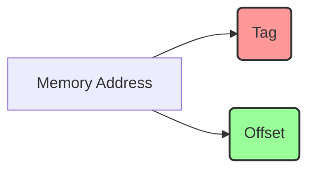

# ♾️ Fully Associative Cache: อิสระขั้นสุด ไร้ขีดจำกัดเรื่องตำแหน่ง

## 💡 แนวคิดพื้นฐานและหน้าที่ (Concept & Purpose)

หากเปรียบ Direct Mapped เป็น "ที่จอดรถแบบระบุช่องตายตัว" และ Set-Associative เป็น "การแบ่งจอดเป็นโซน" สำหรับ **Fully Associative Cache** นั้นเปรียบเสมือน **"บริการรับจอดรถ (Valet Parking)"** ครับ!

ในระบบนี้ ข้อมูลจาก Main Memory สามารถถูกนำมาวาง (Map) ไว้ที่ **ตำแหน่งไหนก็ได้ใน Cache** ที่ยังมีพื้นที่ว่างอยู่  โดยไม่มีการบังคับหรือล็อกตำแหน่งใดๆ ทั้งสิ้น ความยืดหยุ่นขั้นสุดนี้ถูกออกแบบมาเพื่อรีดประสิทธิภาพในการเก็บข้อมูลให้ได้มากที่สุด และกำจัดปัญหาการแย่งที่อยู่ (Conflict Miss) ให้หมดไป

---

## 🧩 โครงสร้างการแบ่ง Address Bits (Decomposition)

เนื่องจากระบบอนุญาตให้วาง Block ข้อมูลไว้ตรงไหนก็ได้ใน Cache **ระบบจึงไม่มีความจำเป็นต้องใช้ Index Bits (หมายเลขแถว/โซน) อีกต่อไป** 

ดังนั้น Memory Address จะถูกแบ่งออกเป็นแค่ **2 ส่วน** เท่านั้น:

* **Tag:** ป้ายชื่อที่ต้องใช้จำนวน Bits มากขึ้น เพราะต้องระบุตัวตนของข้อมูลให้ชัดเจนที่สุด
* **Offset:** ตำแหน่งของข้อมูลย่อยภายใน Block นั้นๆ

**แผนภาพจำลอง (Mermaid Diagram):**

---

## ⚙️ กลไกการทำงานเมื่อเกิด Cache Hit และ Cache Miss

ความมีอิสระย่อมแลกมาด้วยความเหนื่อยในการค้นหาครับ เมื่อ CPU ต้องการข้อมูล กลไกการตรวจสอบจะเป็นดังนี้:

1. **🔍 ค้นหาแบบขนาน (Parallel Search):** เนื่องจากข้อมูลอยู่ตรงไหนก็ได้ CPU จึงต้องนำ Tag จาก Address ไป **เปรียบเทียบกับ Tag ของทุกๆ ช่องใน Cache พร้อมกันทั้งหมด!** 
2.  **✅ Cache Hit:** หากมีช่องใดช่องหนึ่งที่ Tag ตรงกัน ก็สามารถดึงข้อมูลตามพิกัด Offset ไปใช้ได้ทันที
3. **❌ Cache Miss:** หากเปรียบเทียบครบทุกช่องแล้วไม่เจอ Tag นี้เลย แสดงว่าข้อมูลยังไม่ได้ถูกโหลดมา ต้องไปดึงจาก RAM
4. **♻️ เมื่อ Cache เต็ม (Replacement Policy):** ถ้าระบบเต็ม จะดึงลอจิก **LRU (Least Recently Used)** มาใช้ เพื่อหาว่าในบรรดาข้อมูลทั้งหมดใน Cache บล็อกไหนที่ไม่ได้ถูกใช้งานมานานที่สุด ก็จะเตะบล็อกนั้นออกไปเพื่อเปิดทางให้ข้อมูลใหม่

---

## ⚖️ ข้อดี และ ข้อเสีย (Pros & Cons)

| ข้อดี (Pros) | ข้อเสีย (Cons) |
| --- | --- |
|  **ลด Conflict Miss ได้ดีที่สุด:** แทบจะไม่มีปัญหาข้อมูลแย่งที่กันเลย  ตราบใดที่ Cache ยังไม่เต็ม

 |  **ฮาร์ดแวร์ซับซ้อนและแพงมาก:** ต้องใช้วงจรเปรียบเทียบ (Comparators) สำหรับทุกๆ ช่องใน Cache เพื่อค้นหาพร้อมกัน 

 |
| **Hit Rate สูงที่สุด:** เมื่อเทียบกับสถาปัตยกรรมแบบอื่นในขนาด Cache ที่เท่ากัน | **ทำงานช้ากว่าและกินไฟมากกว่า:** การเช็ค Tag จำนวนมหาศาลพร้อมกันใช้ทั้งพลังงานและเวลา |
| **ใช้พื้นที่ได้คุ้มค่า 100%:** ไม่มีช่องว่างสูญเปล่าจากการล็อก Index | **ข้อจำกัดด้านขนาด:** ในความเป็นจริง สถาปัตยกรรมนี้มักถูกจำกัดไว้ใช้กับ Cache ขนาดเล็กๆ เท่านั้น (เช่น TLB ใน CPU) |

---

## 🔢 ตัวอย่างการคำนวณอย่างง่าย (Calculations Example)

มาดูความเรียบง่ายของการแบ่ง Bits ใน Fully Associative กันครับ สมมติว่าระบบของเราใช้สเปคเดิม:

* **Memory Address:** ขนาด 16 bits
* **Cache Size:** 1024 Bytes (1 KB)
* **Block Size:** 16 Bytes

**ขั้นตอนการแบ่ง Bits (Decomposition):**

1. **Offset:** Block Size 16 Bytes ($2^4$) $\rightarrow$ ใช้ **4 bits**
2. **Index:** ไม่ต้องใช้! $\rightarrow$ ใช้ **0 bits**
3. **Tag:** ส่วนที่เหลือทั้งหมด (16 - 4) $\rightarrow$ ใช้ **12 bits**

**โจทย์:** CPU ต้องการดึงข้อมูลที่ Hex Address `0x1A2F`

1. แปลงเป็นฐานสอง (16 bits):

$$0x1A2F = 0001\ 1010\ 0010\ 1111_{2}$$

2. หั่นชิ้นส่วน:
* **Tag (12 bits หน้า):** `000110100010` (หรือเทียบเท่า `0x1A2` ระบบจะนำ Tag ก้อนใหญ่นี้ไปกวาดเทียบกับทุก Block)
* **Offset (4 bits หลัง):** `1111` (ตำแหน่งข้อมูลย่อยที่ 15 ในบล็อก)
